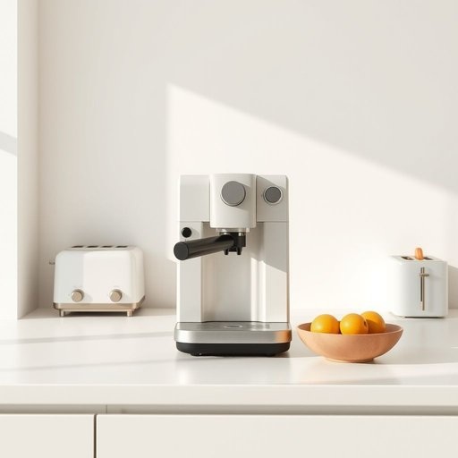

# coffee-maker

<h1 style="font-size: 2.5em; font-weight: 300; letter-spacing: 2px; margin: 0; color: #2c3e50;">
/coffee-maker*/
</h1>

---

---

## 例句

Although the coffee-maker, which sits quietly on the kitchen counter next to the toaster and the fruit bowl, may seem like a simple household appliance, its ability to brew a perfect cup of coffee every morning, whether it's a strong espresso or a milky latte, makes it an indispensable part of our daily routine.

*Although(/ˌɔlˈðoʊ/) the(/ðə/) coffee-maker,(/coffee-maker*,/) which(/wɪʧ/) sits(/sɪts/) quietly(/kˈwaɪətli/) on(/ɔn/) the(/ðə/) kitchen(/ˈkɪʧən/) counter(/ˈkaʊntər/) next(/nɛkst/) to(/tɪ/) the(/ðə/) toaster(/ˈtoʊstər/) and(/ənd/) the(/ðə/) fruit(/frut/) bowl,(/boʊl,/) may(/meɪ/) seem(/sim/) like(/laɪk/) a(/ə/) simple(/ˈsɪmpəl/) household(/ˈhaʊsˌhoʊld/) appliance,(/əˈplaɪəns,/) its(/ɪts/) ability(/əˈbɪləˌti/) to(/tɪ/) brew(/bru/) a(/ə/) perfect(/ˈpərˌfɪkt/) cup(/kəp/) of(/əv/) coffee(/ˈkɔfi/) every(/ˈɛvəri/) morning,(/ˈmɔrnɪŋ,/) whether(/ˈwɛðər/) it's(/ɪts/) a(/ə/) strong(/strɔŋ/) espresso(/ˌɛˈsprɛsoʊ/) or(/ər/) a(/ə/) milky(/ˈmɪlki/) latte,(/ˈlɑˌteɪ,/) makes(/meɪks/) it(/ɪt/) an(/ən/) indispensable(/ˌɪndɪˈspɛnsəbəl/) part(/pɑrt/) of(/əv/) our(/ɑr/) daily(/ˈdeɪli/) routine.(/ruˈtin./)*

**翻译：** 虽然这台咖啡机静静地摆放在厨房台面上，紧挨着烤面包机和水果盘，看似一件简单的家用电器，但它每天早晨都能冲煮出一杯完美的咖啡，无论是浓郁的意式浓缩，还是丝滑的拿铁，使其成为我们日常生活中不可或缺的一部分。

---

## 解释

coffee-maker作为名词，指的是用于制作咖啡的家用或商用电器，在家庭、办公室等日常生活场合中非常常见，通常用来描述各种类型的咖啡机，如滴漏式咖啡机、胶囊咖啡机或法式压滤壶等。英语学习者在使用coffee-maker时需注意其作为复合名词时的连字符写法，这有助于明确它是一个整体的设备名称而非两个独立名词的组合，此外，coffee-maker通常作为可数名词使用，例如“One coffee-maker is broken”表示“一个咖啡机坏了”，而且常见搭配包括“buy a coffee-maker”（买咖啡机）、“use a coffee-maker”（使用咖啡机）、“coffee-maker machine”（尽管略显冗余，但在口语中偶有出现）等表达。该词源于英语中coffee（咖啡）和maker（制造者、制作者）两个单词的组合，字面含义即“制作咖啡的机器”，反映了工业化和家用电器普及后对方便快捷饮品准备设备的命名习惯。在中文语境中，准确翻译为“咖啡机”或“咖啡壶”，视具体类型而定，且无特别褒贬含义，是一个中性词汇，反映现代家庭和办公环境中对咖啡饮用需求的普遍文化现象，其使用通常与舒适生活方式及现代化生活节奏相关联。

---

<small style="color: #999; font-size: 0.9em;">2025-07-17 06:22:39</small>

