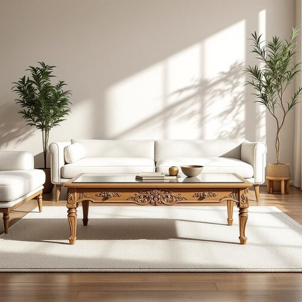

# coffee-table

<h1 style="font-size: 2.5em; font-weight: 300; letter-spacing: 2px; margin: 0; color: #2c3e50;">
/coffee-table*/
</h1>

---

---

## 例句

While arranging the living room to create a cosy atmosphere for our guests, I noticed that the vintage coffee-table, which my grandparents had painstakingly restored with intricate woodwork and a glass top, perfectly complemented the antique sofa set and the patterned rug, serving not only as a functional piece to hold drinks and magazines but also as a charming focal point that tied the entire space together.

*While(/waɪl/) arranging(/ərˈeɪnʤɪŋ/) the(/ðə/) living(/ˈlɪvɪŋ/) room(/rum/) to(/tɪ/) create(/kriˈeɪt/) a(/ə/) cosy(/ˈkoʊzi/) atmosphere(/ˈætməsˌfɪr/) for(/fər/) our(/ɑr/) guests,(/gɛsts,/) I(/aɪ/) noticed(/ˈnoʊtɪst/) that(/ðət/) the(/ðə/) vintage(/ˈvɪntɪʤ/) coffee-table,(/coffee-table*,/) which(/wɪʧ/) my(/maɪ/) grandparents(/ˈgrændˌpɛrənts/) had(/hæd/) painstakingly(/ˈpeɪnˌsteɪkɪŋli/) restored(/rɪˈstɔrd/) with(/wɪθ/) intricate(/ˈɪntrəkət/) woodwork(/ˈwʊdˌwərk/) and(/ənd/) a(/ə/) glass(/glæs/) top,(/tɔp,/) perfectly(/ˈpərfəktli/) complemented(/ˈkɑmpləˌmɛntɪd/) the(/ðə/) antique(/ænˈtik/) sofa(/ˈsoʊfə/) set(/sɛt/) and(/ənd/) the(/ðə/) patterned(/ˈpætərnd/) rug,(/rəg,/) serving(/ˈsərvɪŋ/) not(/nɑt/) only(/ˈoʊnli/) as(/ɛz/) a(/ə/) functional(/ˈfəŋkʃənəl/) piece(/pis/) to(/tɪ/) hold(/hoʊld/) drinks(/drɪŋks/) and(/ənd/) magazines(/ˈmægəˌzinz/) but(/bət/) also(/ˈɔlsoʊ/) as(/ɛz/) a(/ə/) charming(/ˈʧɑrmɪŋ/) focal(/ˈfoʊkəl/) point(/pɔɪnt/) that(/ðət/) tied(/taɪd/) the(/ðə/) entire(/ɪnˈtaɪər/) space(/speɪs/) together.(/təˈgɛðər./)*

**翻译：** 在布置客厅以营造一个温馨舒适的氛围迎接客人时，我注意到那张复古茶几由我的祖父母精心修复，雕刻细腻且配有玻璃桌面，恰到好处地衬托了古董沙发和图案地毯，不仅作为放置饮品和杂志的实用家具，更成为一个魅力独具的视觉焦点，将整个空间完美地连接在一起。

---

## 解释

“coffee-table”作为名词，指的是通常放置于客厅沙发前面、较矮的桌子，主要用于放置咖啡杯、饮品、书籍、杂志或装饰品等家居用品，常见于家庭和休闲空间中。英语学习者在使用该词时应注意其构成为复合名词，由“coffee”（咖啡）和“table”（桌子）组成，整体表示一种特定类型的桌子，单数形式为coffee-table，复数形式为coffee-tables，且通常用作可数名词。在搭配上，常见的表达有“coffee-table book”（指放在咖啡桌上的大型画册或装饰书籍），“coffee-table arrangement”（装饰 coffee-table 的物品摆设）等。该词起源于20世纪初，随着咖啡文化和客厅社交习惯的兴起，专门设计出这种既实用又装饰性的低矮桌子以便于放置茶点和容纳访客使用，体现了英美家庭生活中休闲和社交功能的融合。在中文语境中，coffee-table一般准确译为“茶几”或“咖啡桌”，重点突出其作为低矮摆放茶点和装饰品的家具功能，较“桌子”“桌几”等词更具针对性。需要注意的是，coffee-table本身不带褒贬色彩，属于中性词汇，但因其与休闲生活和家居美学相关，常给人以温馨、舒适的文化联想，是现代家庭客厅布置的重要元素。

---

<small style="color: #999; font-size: 0.9em;">2025-07-17 06:22:39</small>

