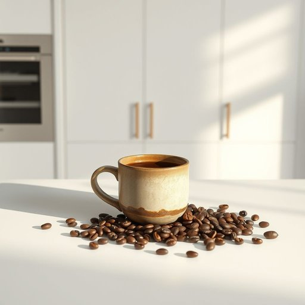

# coffee

<h1 style="font-size: 2.5em; font-weight: 300; letter-spacing: 2px; margin: 0; color: #2c3e50;">
/ˈkɔfi/
</h1>

---

---

## 例句

The coffee in the cupboard, a vital commodity for morning routines, was thoroughly checked to ensure the guests would not be deprived of their cherished brew upon arrival this afternoon.

*The(/ðə/) coffee(/ˈkɔfi/) in(/ɪn/) the(/ðə/) cupboard,(/ˈkəbərd,/) a(/ə/) vital(/ˈvaɪtəl/) commodity(/kəˈmɑdəti/) for(/fər/) morning(/ˈmɔrnɪŋ/) routines,(/ruˈtinz,/) was(/wɑz/) thoroughly(/ˈθəroʊli/) checked(/ʧɛkt/) to(/tɪ/) ensure(/ɪnˈʃʊr/) the(/ðə/) guests(/gɛsts/) would(/wʊd/) not(/nɑt/) be(/bi/) deprived(/dɪˈpraɪvd/) of(/əv/) their(/ðɛr/) cherished(/ˈʧɛrɪʃt/) brew(/bru/) upon(/əˈpɑn/) arrival(/ərˈaɪvəl/) this(/ðɪs/) afternoon.(/ˌæftərˈnun./)*

**翻译：** 橱柜中的咖啡作为晨间习惯中不可或缺的珍品，被仔细检查，以确保来访的宾客今日下午抵达时不会错失他们钟爱的那杯香醇。

---

## 解释

英语单词"coffee"作为名词在家居生活用品的语境中，主要指用咖啡豆研磨而成的饮品，通常指杯装的咖啡液体，是许多家庭日常饮用的提神饮料。使用场合多为早餐、休闲时刻、或者社交场合，如“drinking coffee at home”，强调其作为生活中常见饮品的角色。英语学习者需注意，"coffee"是不可数名词，指的是咖啡这种物质，但在表示“一杯咖啡”时常用复数形式"coffees"来指代多杯咖啡，特别是在点餐或购买时；此外，"coffee"常与量词搭配如"a cup of coffee"、"some coffee"、"a pot of coffee"等，表达数量和形态。常见搭配包括"make coffee"（煮咖啡）、"drink coffee"（喝咖啡）、"coffee beans"（咖啡豆）、"coffee machine"（咖啡机）等。词源上，"coffee"源自阿拉伯语"qahwa"，通过土耳其语"kahve"传入欧洲语言，反映其起源于中东并由此传入欧美文化。中文中准确翻译为“咖啡”，直接指代该饮品，无特殊褒贬色彩，且在中国家庭生活中亦普遍被接受和消费，有时还带有现代、时尚和社交的文化内涵，强调其作为生活品质和文化交流的一部分。

---

<small style="color: #999; font-size: 0.9em;">2025-07-17 06:22:39</small>

