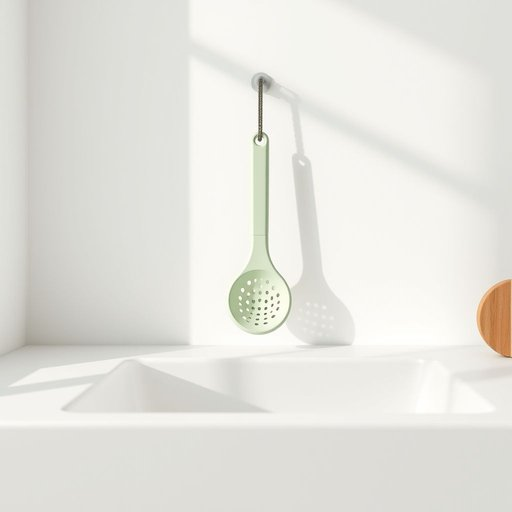

# colander

<h1 style="font-size: 2.5em; font-weight: 300; letter-spacing: 2px; margin: 0; color: #2c3e50;">
/ˈkɑləndər/
</h1>

---

---

## 例句

After draining the pasta, could you please pass me the colander that's hanging next to the sink, the one with the faded green handles, because I want to rinse the vegetables thoroughly before we start preparing the salad?

*After(/ˈæftər/) draining(/ˈdreɪnɪŋ/) the(/ðə/) pasta,(/ˈpɑstə,/) could(/kʊd/) you(/ju/) please(/pliz/) pass(/pæs/) me(/mi/) the(/ðə/) colander(/ˈkɑləndər/) that's(/ðæts/) hanging(/ˈhæŋɪŋ/) next(/nɛkst/) to(/tɪ/) the(/ðə/) sink,(/sɪŋk,/) the(/ðə/) one(/wən/) with(/wɪθ/) the(/ðə/) faded(/ˈfeɪdɪd/) green(/grin/) handles,(/ˈhændəlz,/) because(/bɪˈkəz/) I(/aɪ/) want(/wɔnt/) to(/tɪ/) rinse(/rɪns/) the(/ðə/) vegetables(/ˈvɛʤtəbəlz/) thoroughly(/ˈθəroʊli/) before(/ˌbiˈfɔr/) we(/wi/) start(/stɑrt/) preparing(/pərˈpɛrɪŋ/) the(/ðə/) salad?(/ˈsæləd?/)*

**翻译：** 意面沥干后，能请你把挂在水槽旁那把绿色把手已略显褪色的滤盆递给我吗？我想在开始准备沙拉前，先把蔬菜彻底冲洗干净。

---

## 解释

英语单词“colander”在家居生活用品语境中作为名词，指的是一种用来滤水或沥干液体的厨房用具，通常呈碗状，底部和侧面有许多小孔，便于将煮熟的面条、蔬菜等食物从热水中过滤出来。具体使用场合多见于烹饪步骤中，如煮面后用来沥水，或洗菜时用来冲洗和沥干水分。英语学习者在使用“colander”时需注意它是可数名词，常用复数形式“colanders”，常见搭配有“use a colander”（使用滤水器）、“drain the pasta in a colander”（将意大利面倒入滤器中沥干）等表达。此外，动词短语“strain through a colander”也较常见，表示“通过滤器过滤”。词源上，“colander”源自拉丁语“colum”，意为“滤器”，经过中古法语“coler”及中世纪英语演变而来，体现了其作为过滤工具的本质功能。在中文语境中，“colander”准确翻译为“滤水盆”或“滤网篮”，强调其功能性而非形状，能够帮助理解其主要用途和使用方式。该词无特殊语言色彩或褒贬含义，仅为中性名词，符合厨房用具的常规语义，文化内涵简单且全球通用，使用时注意与其它类似工具如“strainer”（滤器）区分，后者多指较细的过滤网，而“colander”孔径较大，便于快速沥水。

---

<small style="color: #999; font-size: 0.9em;">2025-07-17 06:22:39</small>

