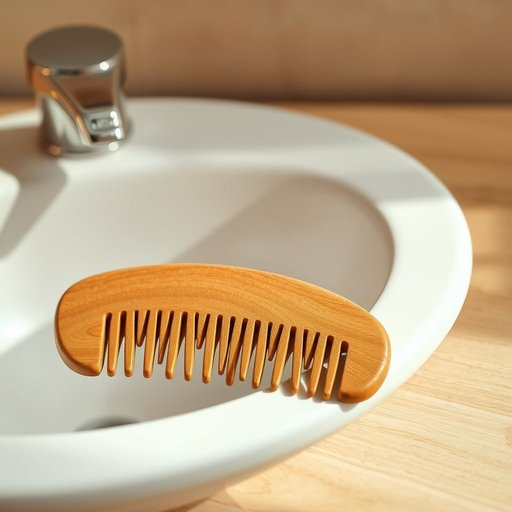

# comb

<h1 style="font-size: 2.5em; font-weight: 300; letter-spacing: 2px; margin: 0; color: #2c3e50;">
/koʊm/
</h1>

---

---

## 例句

Could you please hand me the comb that’s sitting next to the bathroom sink, the one with the wooden handle and fine teeth, because I need to tidy my hair before we head out for dinner?

*Could(/kʊd/) you(/ju/) please(/pliz/) hand(/hænd/) me(/mi/) the(/ðə/) comb(/koʊm/) that’s(/that’s*/) sitting(/ˈsɪtɪŋ/) next(/nɛkst/) to(/tɪ/) the(/ðə/) bathroom(/ˈbæθˌrum/) sink,(/sɪŋk,/) the(/ðə/) one(/wən/) with(/wɪθ/) the(/ðə/) wooden(/ˈwʊdən/) handle(/ˈhændəl/) and(/ənd/) fine(/faɪn/) teeth,(/tiθ,/) because(/bɪˈkəz/) I(/aɪ/) need(/nid/) to(/tɪ/) tidy(/ˈtaɪdi/) my(/maɪ/) hair(/hɛr/) before(/ˌbiˈfɔr/) we(/wi/) head(/hɛd/) out(/aʊt/) for(/fər/) dinner?(/ˈdɪnər?/)*

**翻译：** 请把放在浴室洗手池旁边的那把梳子递给我，就是那把木质手柄、梳齿细密的，因为我需要整理一下头发，准备出门去吃晚饭。

---

## 解释

英语单词“comb”作为名词，在家居生活用品的语境中通常指梳子，即用来理顺头发、解除头发纠结的工具，常见于浴室或梳妆台旁。具体使用场合多为个人护理、日常打理头发时，例如“a plastic comb”表示塑料梳子，“a fine-toothed comb”指齿距密集的梳子，适合理顺细枝末节的头发。英语学习者需要注意“comb”作为可数名词，通常以单数或复数形式出现（combs），且常用搭配包括“hair comb”（头发梳）、“tooth comb”（齿状梳）、“to comb one’s hair”（梳理头发）等，表达时注意动作与工具之间的搭配。此外，“comb”还可作动词，意为“梳理”，但此处主要指名词用法。词源上，“comb”源自古英语“camb”，与德语“Kamm”及荷兰语“Kam”同源，均指头发梳状工具，体现了西日耳曼语族共有的日常生活用品名称传统。在中文语境中，“comb”准确翻译为“梳子”，指用于梳理头发的日用品，含义较为中性，无褒贬色彩，日常交流中普遍使用且易于理解，文化内涵主要体现在个人卫生与形象修饰的意义上，不涉及特殊隐喻或文化敏感性。

---

<small style="color: #999; font-size: 0.9em;">2025-07-17 06:22:39</small>

