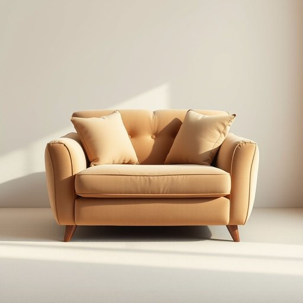

# comfort

<h1 style="font-size: 2.5em; font-weight: 300; letter-spacing: 2px; margin: 0; color: #2c3e50;">
/ˈkəmfərt/
</h1>

---

---

## 例句

After a long day of work, nothing compares to the comfort provided by this plush, oversized armchair, which, with its soft cushions and ergonomic design, not only supports my back but also creates a cozy atmosphere that makes winding down in the living room genuinely enjoyable.

*After(/ˈæftər/) a(/ə/) long(/lɔŋ/) day(/deɪ/) of(/əv/) work,(/wərk,/) nothing(/ˈnəθɪŋ/) compares(/kəmˈpɛrz/) to(/tɪ/) the(/ðə/) comfort(/ˈkəmfərt/) provided(/prəˈvaɪdɪd/) by(/baɪ/) this(/ðɪs/) plush,(/pləʃ,/) oversized(/ˈoʊvərˌsaɪzd/) armchair,(/ˈɑrmˌʧɛr,/) which,(/wɪʧ,/) with(/wɪθ/) its(/ɪts/) soft(/sɔft/) cushions(/ˈkʊʃənz/) and(/ənd/) ergonomic(/ˌərgəˈnɑmɪk/) design,(/dɪˈzaɪn,/) not(/nɑt/) only(/ˈoʊnli/) supports(/səˈpɔrts/) my(/maɪ/) back(/bæk/) but(/bət/) also(/ˈɔlsoʊ/) creates(/kriˈeɪts/) a(/ə/) cozy(/ˈkoʊzi/) atmosphere(/ˈætməsˌfɪr/) that(/ðət/) makes(/meɪks/) winding(/ˈwaɪndɪŋ/) down(/daʊn/) in(/ɪn/) the(/ðə/) living(/ˈlɪvɪŋ/) room(/rum/) genuinely(/ˈʤɛnjuˌaɪnli/) enjoyable.(/ˌɛnˈʤɔɪəbəl./)*

**翻译：** 忙碌了一整天，没有什么能比这款柔软宽大的扶手椅更令人舒适了。它配备了柔软的靠垫和符合人体工学的设计，不仅支撑着我的背部，更营造出一种温馨的氛围，让我在客厅中放松身心，真正享受到惬意的时光。

---

## 解释

英语单词comfort作为名词在家居生活用品的语境中，主要指带来身体或心理上的舒适感和便利的状态或物品，如沙发、床垫、靠垫等能提升居家生活质量的用品。具体使用场合通常涉及描述某种产品是否能够提供良好的支持、柔软度或温暖感，比如the comfort of this sofa表示沙发的舒适感。英语学习者需要注意comfort作为不可数名词时强调舒适的状态，也可作可数名词指具体的安慰物或便利设施，如take comfort in knowing…（从知道…中获得安慰）。常见搭配包括comfort food（安慰食物）、bring comfort（带来安慰）、comfort level（舒适程度）等，且需留意与介词in的搭配表达获得安慰的含义。词源方面，comfort源自中古英语comforten，继承自拉丁语confortare，意为加强或鼓励，反映其带来内心和身体支持的意义。在中文语境中，comfort常译为“舒适”“安慰”或“便利”，视上下文而定，但在家居用品领域，通常强调的是“舒适感”或“舒适性”，体现产品对居家生活质量的提升。此词在日常使用中一般为褒义，无明显贬义或特殊文化色彩，更多侧重于积极的身心感受和生活品质的提升。

---

<small style="color: #999; font-size: 0.9em;">2025-07-17 06:22:39</small>

