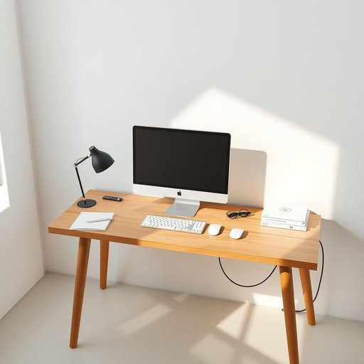

# computer

<h1 style="font-size: 2.5em; font-weight: 300; letter-spacing: 2px; margin: 0; color: #2c3e50;">
/kəmˈpjutər/
</h1>

---

---

## 例句

While I was tidying up the living room this afternoon, I noticed that the computer, which usually sits on the corner desk next to the window and is surrounded by a stack of papers and various cables, had its screen flickering intermittently, prompting me to wonder whether it might need a thorough clean or even some professional repair before I can use it for my work.

*While(/waɪl/) I(/aɪ/) was(/wɑz/) tidying(/tidying*/) up(/əp/) the(/ðə/) living(/ˈlɪvɪŋ/) room(/rum/) this(/ðɪs/) afternoon,(/ˌæftərˈnun,/) I(/aɪ/) noticed(/ˈnoʊtɪst/) that(/ðət/) the(/ðə/) computer,(/kəmˈpjutər,/) which(/wɪʧ/) usually(/ˈjuʒəwəli/) sits(/sɪts/) on(/ɔn/) the(/ðə/) corner(/ˈkɔrnər/) desk(/dɛsk/) next(/nɛkst/) to(/tɪ/) the(/ðə/) window(/ˈwɪndoʊ/) and(/ənd/) is(/ɪz/) surrounded(/sərˈaʊndɪd/) by(/baɪ/) a(/ə/) stack(/stæk/) of(/əv/) papers(/ˈpeɪpərz/) and(/ənd/) various(/ˈvɛriəs/) cables,(/ˈkeɪbəlz,/) had(/hæd/) its(/ɪts/) screen(/skrin/) flickering(/ˈflɪkərɪŋ/) intermittently,(/ˌɪntərˈmɪtəntli,/) prompting(/ˈprɑmptɪŋ/) me(/mi/) to(/tɪ/) wonder(/ˈwəndər/) whether(/ˈwɛðər/) it(/ɪt/) might(/maɪt/) need(/nid/) a(/ə/) thorough(/θəroʊ/) clean(/klin/) or(/ər/) even(/ˈivɪn/) some(/səm/) professional(/prəˈfɛʃənəl/) repair(/rɪˈpɛr/) before(/ˌbiˈfɔr/) I(/aɪ/) can(/kən/) use(/juz/) it(/ɪt/) for(/fər/) my(/maɪ/) work.(/wərk./)*

**翻译：** 今天下午我整理客厅时，注意到那台通常放在靠窗角落书桌上、周围堆满纸张和各种电线的电脑，屏幕时断时续地闪烁着，这让我怀疑它是否需要彻底清洁，甚至可能需要专业维修，才能继续用于工作。

---

## 解释

英语单词"computer"作为名词，在家居生活用品的语境中主要指用于办公、学习、娱乐或家庭管理的一种电子设备，通常是台式机、笔记本电脑或一体机，广泛应用于家庭环境中进行文字处理、网络浏览、影音播放等活动。使用该词时，英语学习者需注意其单数形式"computer"和复数形式"computers"的区别，通常前面可搭配不定冠词"a computer"，或定冠词"the computer"来指代特定设备；常见的搭配有"personal computer"（个人电脑）、"desktop computer"（台式电脑）、"laptop computer"（笔记本电脑）、"use a computer"（使用电脑）等。此外，"computer"作为可数名词，后面可以接定语从句或形容词短语修饰。词源方面，"computer"源自拉丁语"computare"，意为“计算”，最初指代进行计算或数据处理的人，20世纪中叶随着电子计算机的发明，词义逐渐转变为指代现代电子计算设备。在中文语境中，"computer"通常准确翻译为“电脑”或“计算机”，其中“电脑”更口语化、贴近日常生活，而“计算机”则更正式，适用于技术或教育领域，两者含义相近但侧重点略有差异。该词本身无明显褒贬色彩，是中性词，但在某些语境中可能因人们对电子设备依赖的讨论而带有一定的社会文化内涵，如“科技进步”“信息时代”等主题下的象征意义。总体而言，"computer"在家居生活用语中是一种常见且重要的现代生活必备用品词汇。

---

<small style="color: #999; font-size: 0.9em;">2025-07-17 06:22:39</small>

