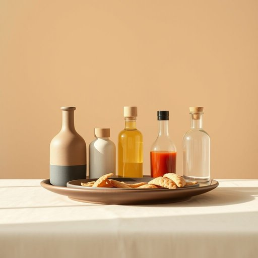

# condiment

<h1 style="font-size: 2.5em; font-weight: 300; letter-spacing: 2px; margin: 0; color: #2c3e50;">
/ˈkɑndəmənt/
</h1>

---

---

## 例句

When the table’s setting became an art, the Sunday lunch’s condiment—malt vinegar, English mustard, and chutney—turned personalization into tradition.

*When(/wɪn/) the(/ðə/) table’s(/table’s*/) setting(/ˈsɛtɪŋ/) became(/bɪˈkeɪm/) an(/ən/) art,(/ɑrt,/) the(/ðə/) Sunday(/ˈsənˌdi/) lunch’s(/lunch’s*/) condiment—malt(/condiment—malt*/) vinegar,(/ˈvɪnəgər,/) English(/ˈɪŋlɪʃ/) mustard,(/ˈməstərd,/) and(/ənd/) chutney—turned(/chutney—turned*/) personalization(/ˌpərsənələˈzeɪʃən/) into(/ˈɪntu/) tradition.(/trəˈdɪʃən./)*

**翻译：** 当餐桌布置成为一门艺术，周日午餐的调味品——麦芽醋、英式芥末酱和酸甜酱——也就将个性化转化为传统。

---

## 解释

英语单词“condiment”作为名词，主要指餐桌上用于调味的各种佐料，如盐、胡椒、酱油、芥末、醋、辣酱等，常见于家居生活用品语境中，尤其是在描述厨房或餐厅环境时使用，例如“Please pass the condiments”（请传一下调味品）；使用时需注意该词通常是复数形式用于泛指多种调味料，单数形式较少见且不常单独使用。常见搭配包括“condiment bottle”（调味瓶）、“condiment set”（调味品套装）等，表达时多与具体调味品名词或容器搭配出现。词源方面，“condiment”源自拉丁语“condimentum”，意为“调味品、香料”，通过古法语传入英语，体现其作为辅助食物风味的功能。在中文语境中，“condiment”准确译为“调味品”或“佐料”，强调其用以增添食物口味的属性，不含贬义或特别褒义，属于中性词汇。文化上，西方餐桌上“condiments”种类丰富，且摆放讲究，反映了饮食细节与礼仪，学习时应避免将其混淆为主料或小吃等其他概念。

---

<small style="color: #999; font-size: 0.9em;">2025-07-17 06:22:39</small>

