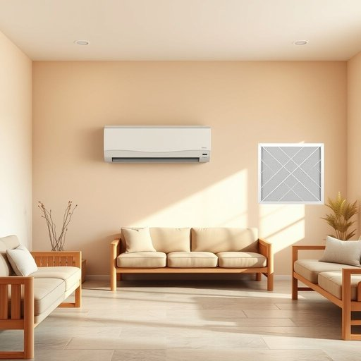

# conditioner

<h1 style="font-size: 2.5em; font-weight: 300; letter-spacing: 2px; margin: 0; color: #2c3e50;">
/kənˈdɪʃənər/
</h1>

---

---

## 例句

Before you start painting the walls in the living room, make sure to switch off the air conditioner and, while you’re at it, check whether the conditioner filter needs cleaning or replacing, as a blocked filter not only reduces efficiency but can also worsen indoor air quality over time.

*Before(/ˌbiˈfɔr/) you(/ju/) start(/stɑrt/) painting(/ˈpeɪnɪŋ/) the(/ðə/) walls(/wɔlz/) in(/ɪn/) the(/ðə/) living(/ˈlɪvɪŋ/) room,(/rum,/) make(/meɪk/) sure(/ʃʊr/) to(/tɪ/) switch(/swɪʧ/) off(/ɔf/) the(/ðə/) air(/ɛr/) conditioner(/kənˈdɪʃənər/) and,(/ənd,/) while(/waɪl/) you’re(/you’re*/) at(/æt/) it,(/ɪt,/) check(/ʧɛk/) whether(/ˈwɛðər/) the(/ðə/) conditioner(/kənˈdɪʃənər/) filter(/ˈfɪltər/) needs(/nidz/) cleaning(/ˈklinɪŋ/) or(/ər/) replacing,(/rɪˈpleɪsɪŋ,/) as(/ɛz/) a(/ə/) blocked(/blɑkt/) filter(/ˈfɪltər/) not(/nɑt/) only(/ˈoʊnli/) reduces(/rɪˈdusɪz/) efficiency(/ɪˈfɪʃənsi/) but(/bət/) can(/kən/) also(/ˈɔlsoʊ/) worsen(/ˈwərsən/) indoor(/ˈɪnˌdɔr/) air(/ɛr/) quality(/kˈwɑləti/) over(/ˈoʊvər/) time.(/taɪm./)*

**翻译：** 在开始粉刷客厅墙壁之前，务必先关闭空调，同时顺便检查空调滤网是否需要清洁或更换，因为堵塞的滤网不仅会降低空调效率，还可能随着时间推移恶化室内空气质量。

---

## 解释

英语单词“conditioner”在家居生活用品语境中主要指用来改善或维持某物状态的产品，最常见的是“hair conditioner”（护发素）和“air conditioner”（空调）。作为名词，conditioner一般用来表示一种护理、调节或改善物品品质的装置或物品，使用场合多见于个人护理（如护发素，帮助头发柔顺、滋养）或家居环境设备（如空调，调节室内空气温度和湿度）。英语学习者在使用时需注意：conditioner作为可数名词，通常前面会有限定词如a/an或the，且常与hair或air等名词搭配形成短语，如“a hair conditioner”“the air conditioner”；此外，理解context时要区分“conditioner”指的是液体护理产品还是电器设备。词源上，“conditioner”源自动词“condition”，意为“使处于某种状态”，后缀“-er”表示施动者或物，即“起条件作用的东西”，因此延伸到护发素、空调等改善条件的物品。中文中，“conditioner”在家居用品中最准确的翻译是“护发素”（指头发护理用品）或“空调”（指调节空气的设备），根据具体语境确定。需要注意的是，conditioner本身没有褒贬色彩，但在口语中“air conditioner”常简称为“AC”，护发素则是日常美容护理用品，无特殊文化内涵或隐含意义。总之，“conditioner”在家居生活中多指调节或护理用具，使用时结合具体搭配正确理解其含义和语法结构，是英语学习者掌握家庭和个人护理相关表达的重要词汇。

---

<small style="color: #999; font-size: 0.9em;">2025-07-17 06:22:39</small>

