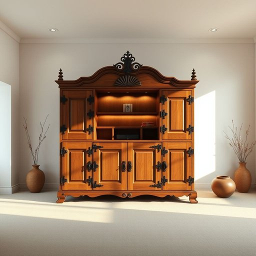

# console

<h1 style="font-size: 2.5em; font-weight: 300; letter-spacing: 2px; margin: 0; color: #2c3e50;">
/ˈkɑnsoʊl/
</h1>

---

---

## 例句

After rearranging the living room to create a cozier atmosphere, she carefully positioned the vintage console, which not only served as a practical storage unit for remote controls and magazines but also added a touch of mid-century charm that perfectly complemented the minimalist decor.

*After(/ˈæftər/) rearranging(/ˌriərˈeɪnʤɪŋ/) the(/ðə/) living(/ˈlɪvɪŋ/) room(/rum/) to(/tɪ/) create(/kriˈeɪt/) a(/ə/) cozier(/ˈkoʊziər/) atmosphere,(/ˈætməsˌfɪr,/) she(/ʃi/) carefully(/ˈkɛrfəli/) positioned(/pəˈzɪʃənd/) the(/ðə/) vintage(/ˈvɪntɪʤ/) console,(/ˈkɑnsoʊl,/) which(/wɪʧ/) not(/nɑt/) only(/ˈoʊnli/) served(/sərvd/) as(/ɛz/) a(/ə/) practical(/ˈpræktɪkəl/) storage(/ˈstɔrɪʤ/) unit(/ˈjunɪt/) for(/fər/) remote(/rɪˈmoʊt/) controls(/kənˈtroʊlz/) and(/ənd/) magazines(/ˈmægəˌzinz/) but(/bət/) also(/ˈɔlsoʊ/) added(/ˈædɪd/) a(/ə/) touch(/təʧ/) of(/əv/) mid-century(/mid-century*/) charm(/ʧɑrm/) that(/ðət/) perfectly(/ˈpərfəktli/) complemented(/ˈkɑmpləˌmɛntɪd/) the(/ðə/) minimalist(/ˈmɪnəməlɪst/) decor.(/ˈdeɪkɔr./)*

**翻译：** 在重新布置客厅以营造更温馨的氛围后，她小心翼翼地摆放了那台复古的音响柜。这不仅作为遥控器和杂志的实用收纳单元，还增添了一抹中世纪风格的魅力，完美地衬托出极简装修的格调。

---

## 解释

英语单词“console”作为名词在家居生活用品的语境中，通常指“控制台”或“仪表盘”，例如电视机控制台、游戏控制台、音响设备的控制台等，具体使用场合多见于描述家具或电子设备上安置开关、按钮和显示屏的部分。英语学习者在使用“console”时应注意，其名词形式通常不可数，也可作可数名词表示具体的控制台设备，常见搭配有“game console”（游戏机）、“control console”（控制台）、“audio console”（音频控制台）等。此外，“console”作为名词时与动词“console”（安慰）在发音上有所不同，名词读作‘ˈkɒnsoʊl’，动词为/kənˈsoʊl/，需区别使用，其词义不应混淆。词源上，“console”来自拉丁语“consolari”，意为“安慰”，但作为名词在现代技术和家居用品中引申为控制和操作的面板，体现了“支撑”与“辅助”功能的隐喻。中文语境中，“console”准确翻译为“控制台”、“仪表盘”或“操控台”，强调其作为操作界面或控制设备的含义，没有褒贬色彩，属于中性技术名词，但考虑文化背景时，特指“游戏机”时，中文“游戏机”比“控制台”更通用且口语化，需根据具体情境选择合适表达。

---

<small style="color: #999; font-size: 0.9em;">2025-07-17 06:22:39</small>

