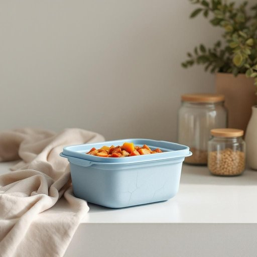

# container

<h1 style="font-size: 2.5em; font-weight: 300; letter-spacing: 2px; margin: 0; color: #2c3e50;">
/kənˈteɪnər/
</h1>

---

---

## 例句

Could you please wash the container that we used to store the leftover stew last night, the one with the blue lid that’s a bit cracked, before you put it away in the cupboard alongside the other plastic containers and glass jars?

*Could(/kʊd/) you(/ju/) please(/pliz/) wash(/wɑʃ/) the(/ðə/) container(/kənˈteɪnər/) that(/ðət/) we(/wi/) used(/juzd/) to(/tɪ/) store(/stɔr/) the(/ðə/) leftover(/ˈlɛfˌtoʊvər/) stew(/stu/) last(/læst/) night,(/naɪt,/) the(/ðə/) one(/wən/) with(/wɪθ/) the(/ðə/) blue(/blu/) lid(/lɪd/) that’s(/that’s*/) a(/ə/) bit(/bɪt/) cracked,(/krækt,/) before(/ˌbiˈfɔr/) you(/ju/) put(/pʊt/) it(/ɪt/) away(/əˈweɪ/) in(/ɪn/) the(/ðə/) cupboard(/ˈkəbərd/) alongside(/əˈlɔŋˈsaɪd/) the(/ðə/) other(/ˈəðər/) plastic(/ˈplæstɪk/) containers(/kənˈteɪnərz/) and(/ənd/) glass(/glæs/) jars?(/ʤɑrz?/)*

**翻译：** 请先帮忙把那个带蓝色略有裂痕的盖子洗干净，再把它和其他塑料盒及玻璃罐一起放进橱柜，那是用来盛放昨晚剩炖菜的容器。

---

## 解释

英语单词“container”在家居生活用品场景中作为名词，通常指用来盛装、储存或运输物品的容器，如盒子、罐子、瓶子、箱子等，常见于厨房收纳、食品保存、办公整理等具体使用场合和语境，例如，在厨房中常说“food container”指储存食物的盒子，或“storage container”指储藏杂物的容器，学习者使用时需注意“container”作为可数名词，通常有复数形式“containers”，其后可接介词短语如“container for”（用于……的容器）或修饰限定词如“plastic container”，且常与表示内容物的名词搭配，如“water container”（水容器）、“large container”（大容器）等，表达时可结合具体形容词或用途名词更准确地描述，避免泛泛而谈，词源上，“container”源自拉丁语“continere”意为“包含、容纳”，经过法语借入英语，强调其承载或盛装功能，在中文语境中，“container”通常被译为“容器”，是一个中性词，无褒贬含义，指代各种家居环境下盛放物品的器具，强调实用性和功能性，在日常生活中广泛使用，综上，“container”在家居生活用品领域代表多样化的盛装用具，是结构清晰且表达精准的常用名词。

---

<small style="color: #999; font-size: 0.9em;">2025-07-17 06:22:39</small>

