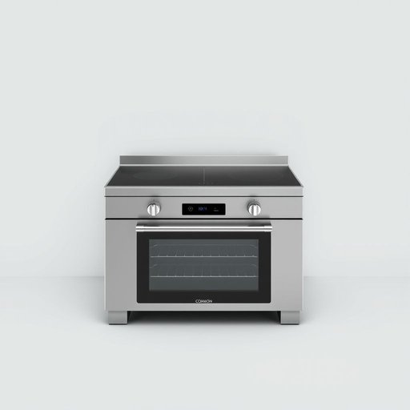

# cooker

<h1 style="font-size: 2.5em; font-weight: 300; letter-spacing: 2px; margin: 0; color: #2c3e50;">
/ˈkʊkər/
</h1>

---

---

## 例句

Could you please check if the cooker in the kitchen, which has the induction hob and the double oven, is working properly, because I need to prepare dinner and I’m not sure whether the gas supply is connected correctly or if there's an issue with the ignition?

*Could(/kʊd/) you(/ju/) please(/pliz/) check(/ʧɛk/) if(/ɪf/) the(/ðə/) cooker(/ˈkʊkər/) in(/ɪn/) the(/ðə/) kitchen,(/ˈkɪʧən,/) which(/wɪʧ/) has(/həz/) the(/ðə/) induction(/ˌɪnˈdəkʃən/) hob(/hɑb/) and(/ənd/) the(/ðə/) double(/ˈdəbəl/) oven,(/ˈəvən,/) is(/ɪz/) working(/ˈwərkɪŋ/) properly,(/ˈprɑpərli,/) because(/bɪˈkəz/) I(/aɪ/) need(/nid/) to(/tɪ/) prepare(/priˈpɛr/) dinner(/ˈdɪnər/) and(/ənd/) I’m(/i’m*/) not(/nɑt/) sure(/ʃʊr/) whether(/ˈwɛðər/) the(/ðə/) gas(/gæs/) supply(/səˈplaɪ/) is(/ɪz/) connected(/kəˈnɛktɪd/) correctly(/kərˈɛktli/) or(/ər/) if(/ɪf/) there's(/ðɛrz/) an(/ən/) issue(/ˈɪʃu/) with(/wɪθ/) the(/ðə/) ignition?(/ˌɪgˈnɪʃən?/)*

**翻译：** 请您帮忙检查一下厨房里的灶具——带有电磁炉灶面和双层烤箱的那台——是否正常使用，因为我需要准备晚餐，但不确定燃气是否接好，或者点火是否存在问题。

---

## 解释

英语单词“cooker”在家居生活用品的语境中作为名词，指的是用于烹饪食物的设备，通常特指炉具或炊具，例如煤气灶、电炉或带烤箱的炉具。具体使用场合多见于厨房设备介绍、烹饪指南或家电选购等语境中，常见表达有“gas cooker”（燃气灶）、“electric cooker”（电饭煲或电炉）、“pressure cooker”（高压锅）等。学习者需注意“cooker”作为可数名词，需根据具体指代的数量进行单复数变化，且与具体种类连用时常构成复合名词。此外，与“stove”（美式英语中炉子的常用词）和“oven”（烤箱）等词语存在细微区别，“cooker”常更偏向综合炉灶设备。词源上，“cooker”来自于动词“cook”（烹饪）加名词后缀“-er”，表示“进行烹饪的器具”。在中文语境中，“cooker”较准确的翻译为“炉灶”或“炊具”，视具体设备而定，如“pressure cooker”常译为“高压锅”，“electric cooker”多译为“电饭煲”或“电炖锅”。需要注意的是，“cooker”在英国英语中用得较多，而美式英语中常用“stove”替代，学习时应结合地域习惯。整体来看，“cooker”一词无明显褒贬或文化色彩，属于中性词汇，主要用于描述烹饪设备。

---

<small style="color: #999; font-size: 0.9em;">2025-07-17 06:22:39</small>

