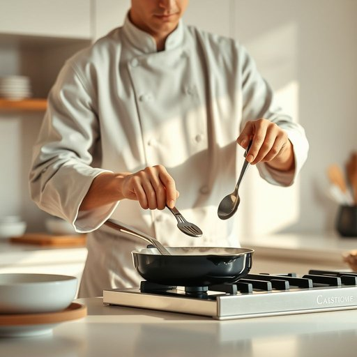

# cooking

<h1 style="font-size: 2.5em; font-weight: 300; letter-spacing: 2px; margin: 0; color: #2c3e50;">
/ˈkʊkɪŋ/
</h1>

---

---

## 例句

Although the cooking equipment was expensive, the chef preferred using it because it ensured even heat distribution essential for perfect dishes.

*Although(/ˌɔlˈðoʊ/) the(/ðə/) cooking(/ˈkʊkɪŋ/) equipment(/ɪkˈwɪpmənt/) was(/wɑz/) expensive,(/ɪkˈspɛnsɪv,/) the(/ðə/) chef(/ʃɛf/) preferred(/prɪˈfərd/) using(/ˈjuzɪŋ/) it(/ɪt/) because(/bɪˈkəz/) it(/ɪt/) ensured(/ɪnˈʃʊrd/) even(/ˈivɪn/) heat(/hit/) distribution(/ˌdɪstrəˈbjuʃən/) essential(/ɛˈsɛnʃəl/) for(/fər/) perfect(/ˈpərˌfɪkt/) dishes.(/ˈdɪʃɪz./)*

**翻译：** 尽管这套烹饪设备价格不菲，厨师仍偏爱使用它，因为它能确保均匀的热量分布，这对制作完美菜肴至关重要。

---

## 解释

英语单词“cooking”在家居生活用品的语境中作为名词，主要指烹饪这一活动或过程，通常用于描述在家庭厨房进行食物准备、加热和制作的行为，如“Cooking is an essential part of daily life”（烹饪是日常生活的重要部分）。它常出现于描述厨房用具、食物制作技巧或饮食习惯的场合，比如“cooking utensils”（烹饪用具）、“cooking methods”（烹饪方法）等。学习者需要注意，“cooking”作为动名词时既可表示动作本身，也可用作不可数名词，强调烹饪这门技能或艺术，通常不可与复数形式连用。常见的搭配有“cooking skills”（烹饪技巧）、“home cooking”（家常菜）、“cooking time”（烹饪时间），这些短语有助于准确表达具体语义。词源上，“cooking”来源于古英语“cōcian”，意为“加热、烹调”，其根源可追溯到拉丁语“coquere”，体现了食物处理的传统工艺。中文语境中，“cooking”应准确译为“烹饪”或“做饭”，强调的是操作和过程，而非单纯的食物，避免误译为“菜肴”或“食品”。该词无明显褒贬色彩，属于中性词汇，但在文化层面上，烹饪常被视为家庭温馨与生活品质的体现，因此“home cooking”常带有亲切、健康、传统的文化内涵。

---

<small style="color: #999; font-size: 0.9em;">2025-07-17 06:22:39</small>

