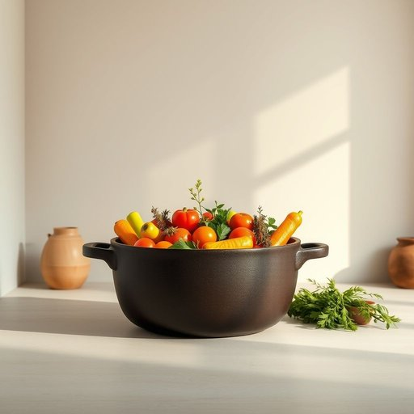

# cookpot

<h1 style="font-size: 2.5em; font-weight: 300; letter-spacing: 2px; margin: 0; color: #2c3e50;">
/cookpot*/
</h1>

---

---

## 例句

After unpacking the groceries, she carefully placed the fresh vegetables and aromatic herbs into the large cast-iron cookpot, which, having been passed down through generations, not only served as a reliable vessel for slow-cooked stews but also held sentimental value, reminding her of countless family dinners filled with laughter and warmth.

*After(/ˈæftər/) unpacking(/ənˈpækɪŋ/) the(/ðə/) groceries,(/ˈgroʊsəriz,/) she(/ʃi/) carefully(/ˈkɛrfəli/) placed(/pleɪst/) the(/ðə/) fresh(/frɛʃ/) vegetables(/ˈvɛʤtəbəlz/) and(/ənd/) aromatic(/ˌɛrəˈmætɪk/) herbs(/ərbz/) into(/ˈɪntu/) the(/ðə/) large(/lɑrʤ/) cast-iron(/cast-iron*/) cookpot,(/cookpot*,/) which,(/wɪʧ,/) having(/ˈhævɪŋ/) been(/bɪn/) passed(/pæst/) down(/daʊn/) through(/θru/) generations,(/ˌʤɛnərˈeɪʃənz,/) not(/nɑt/) only(/ˈoʊnli/) served(/sərvd/) as(/ɛz/) a(/ə/) reliable(/rɪˈlaɪəbəl/) vessel(/ˈvɛsəl/) for(/fər/) slow-cooked(/slow-cooked*/) stews(/stuz/) but(/bət/) also(/ˈɔlsoʊ/) held(/hɛld/) sentimental(/ˌsɛnəˈmɛnəl/) value,(/ˈvælju,/) reminding(/riˈmaɪndɪŋ/) her(/hər/) of(/əv/) countless(/ˈkaʊntləs/) family(/ˈfæməli/) dinners(/ˈdɪnərz/) filled(/fɪld/) with(/wɪθ/) laughter(/ˈlæftər/) and(/ənd/) warmth.(/wɔrmθ./)*

**翻译：** 她在整理好杂货后，小心翼翼地将新鲜的蔬菜和芳香的草药放入那只祖传的大铸铁锅中。那口锅不仅是慢炖汤料的可靠器皿，更承载着深厚的情感价值，令她想起无数充满欢声笑语与温馨的家庭晚餐。

---

## 解释

“cookpot”作为英语名词，指的是一种用于烹饪的锅，通常是较大、带盖的炊具，适合在炉灶上煮炖食物，广泛应用于家庭厨房中。在家居生活用品场景下，cookpot多用于描述烹调汤、炖菜、煮粥等需要较长时间慢炖的过程，常见于北美及英国英语环境。英语学习者在使用“cookpot”时要注意，它是一个可数名词，单数形式为“cookpot”，复数形式为“cookpots”，且常与动词如“use”、“buy”、“clean”搭配，表达为“use a cookpot”，英文表达中也可结合形容词如“large cookpot”、“heavy-duty cookpot”来细化描述。该词源于“cook”（烹饪）和“pot”（锅）的组合，直观描述了其功能和形态，词汇结构简单，无特殊隐喻或文化色彩，属于中性词汇。在中文语境下，“cookpot”准确翻译为“炖锅”或“大锅”，强调其用于炖煮的用途和较大容量，区别于普通平底锅或炒锅。该词在家庭生活中多指耐用、容量较大的厨具，没有褒贬含义，也无特定文化内涵，是描述厨房用具时较为常用的术语。

---

<small style="color: #999; font-size: 0.9em;">2025-07-17 06:22:39</small>

