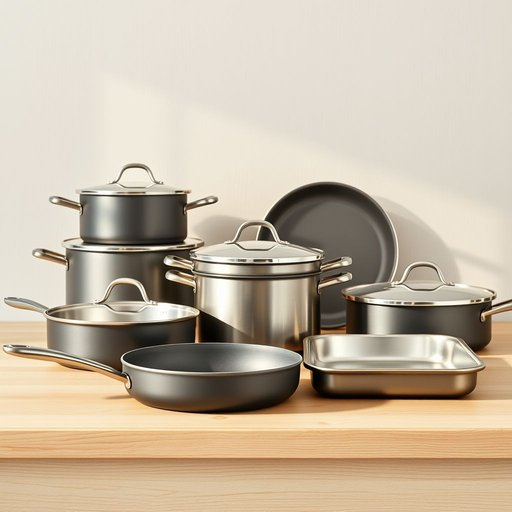

# cookware

<h1 style="font-size: 2.5em; font-weight: 300; letter-spacing: 2px; margin: 0; color: #2c3e50;">
/ˈkʊkˌwɛr/
</h1>

---

---

## 例句

When we were redecorating the kitchen last month, I insisted on investing in high-quality cookware, not only because durable pots and pans enhance the cooking experience, but also because they retain heat more efficiently, which is crucial when preparing meals for the whole family during busy weeknights.

*When(/wɪn/) we(/wi/) were(/wər/) redecorating(/riˈdɛkərˌeɪtɪŋ/) the(/ðə/) kitchen(/ˈkɪʧən/) last(/læst/) month,(/mənθ,/) I(/aɪ/) insisted(/ˌɪnˈsɪstɪd/) on(/ɔn/) investing(/ˌɪnˈvɛstɪŋ/) in(/ɪn/) high-quality(/ˌhaɪkˈwɑləti/) cookware,(/ˈkʊkˌwɛr,/) not(/nɑt/) only(/ˈoʊnli/) because(/bɪˈkəz/) durable(/ˈdʊrəbəl/) pots(/pɑts/) and(/ənd/) pans(/pænz/) enhance(/ɛnˈhæns/) the(/ðə/) cooking(/ˈkʊkɪŋ/) experience,(/ɪkˈspɪriəns,/) but(/bət/) also(/ˈɔlsoʊ/) because(/bɪˈkəz/) they(/ðeɪ/) retain(/rɪˈteɪn/) heat(/hit/) more(/mɔr/) efficiently,(/ɪˈfɪʃəntli,/) which(/wɪʧ/) is(/ɪz/) crucial(/ˈkruʃəl/) when(/wɪn/) preparing(/pərˈpɛrɪŋ/) meals(/milz/) for(/fər/) the(/ðə/) whole(/hoʊl/) family(/ˈfæməli/) during(/ˈdʊrɪŋ/) busy(/ˈbɪzi/) weeknights.(/weeknights*./)*

**翻译：** 上个月我们重新装修厨房时，我坚持投资高品质的炊具，不仅因为耐用的锅具能提升烹饪体验，更因为它们能够更高效地保持热量，这在忙碌的周日晚间为全家准备饭菜时尤为重要。

---

## 解释

“cookware”作为名词，指的是厨房中用于烹饪的各种器具和用具，如锅、平底锅、煎锅、烤盘等，主要出现在描述家居生活用品、厨房设备或烹饪用具的语境中。英语学习者需要注意，“cookware”是不可数名词，通常不加复数形式，但在某些情况下也可用复数形式“cookwares”表示不同种类的厨具，不过较少见；搭配时常用的有“kitchen cookware”（厨房炊具）、“non-stick cookware”（不粘锅具）、“stainless steel cookware”（不锈钢炊具）等，表达时要注意与形容词的搭配使用以突出材质或功能。词源上，“cookware”由“cook”（烹饪）和“ware”（器具、物品）组合而成，“ware”一词源自古英语“waru”，意指商品或器具，合成词形象地表达了“用于烹饪的器具”这一含义。在中文语境中，“cookware”通常准确翻译为“炊具”或“厨房炊具”，强调其专用于烹饪的功能，与一般的厨房用具（如餐具cutlery、厨房用具kitchen utensils）有所区分。该词语无特殊褒贬色彩，属于中性词汇，在家庭、餐饮和厨具销售等场合广泛使用，体现的是实用性和功能性，其文化内涵与健康烹饪、厨房生活质量提升紧密相关。

---

<small style="color: #999; font-size: 0.9em;">2025-07-17 06:22:39</small>

