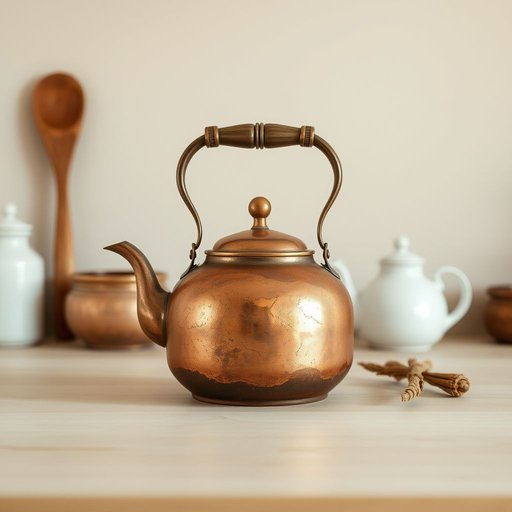

# copper

<h1 style="font-size: 2.5em; font-weight: 300; letter-spacing: 2px; margin: 0; color: #2c3e50;">
/ˈkɑpər/
</h1>

---

---

## 例句

I asked my mum if she could check the old copper kettle that’s been sitting on the stove for years, because despite its tarnished exterior, it supposedly heats up water faster than any of the modern stainless steel ones we have in the cupboard.

*I(/aɪ/) asked(/æst/) my(/maɪ/) mum(/məm/) if(/ɪf/) she(/ʃi/) could(/kʊd/) check(/ʧɛk/) the(/ðə/) old(/oʊld/) copper(/ˈkɑpər/) kettle(/ˈkɛtəl/) that’s(/that’s*/) been(/bɪn/) sitting(/ˈsɪtɪŋ/) on(/ɔn/) the(/ðə/) stove(/stoʊv/) for(/fər/) years,(/jɪrz,/) because(/bɪˈkəz/) despite(/dɪˈspaɪt/) its(/ɪts/) tarnished(/ˈtɑrnɪʃt/) exterior,(/ɪkˈstɪriər,/) it(/ɪt/) supposedly(/səˈpoʊzədli/) heats(/hits/) up(/əp/) water(/ˈwɔtər/) faster(/ˈfæstər/) than(/ðən/) any(/ˈɛni/) of(/əv/) the(/ðə/) modern(/ˈmɑdərn/) stainless(/ˈsteɪnləs/) steel(/stil/) ones(/wənz/) we(/wi/) have(/hæv/) in(/ɪn/) the(/ðə/) cupboard.(/ˈkəbərd./)*

**翻译：** 我问妈妈能否帮忙看看那只多年来一直摆在炉子上的旧铜壶，尽管表面已经暗淡无光，但据说它烧水的速度比我们橱柜里那些现代的不锈钢壶都要快。

---

## 解释

英语单词“copper”作为名词在家居生活用品的语境中，通常指“铜”这种金属材料，广泛用于制造各种厨具、水管、装饰品等家庭用品。例如，厨房中的铜锅、铜制水管或铜质灯具等都是“copper”应用的具体场合。英语学习者在使用该词时应注意其不可数和可数两种用法：指物质本身时多为不可数名词，如“copper is a good conductor of heat”（铜是良好的导热体）；指具体的铜制品时可用复数形式，如“coppers”（铜制器皿），但该用法较少见且多依赖上下文。此外，常见搭配有“copper wire”（铜线）、“copper pipe”（铜管）、“copper pot”（铜锅）等，学习者可通过这些搭配理解其具体应用场景。词源方面，“copper”源自中古英语“coper”，进一步来自拉丁语“cuprum”，意指古代岛屿塞浦路斯（Cyprus）上的铜矿，这反映了铜及其矿产的历史渊源。在中文语境中，“copper”准确译为“铜”，指的是化学元素及其金属形态，强调其优良的导电、导热性能及在家用品中的广泛应用。值得注意的是，“copper”在英式口语中有时作为俚语用来指代“警察”，但在家居生活用品语境中不具备此类特殊含义，无褒贬色彩，主要侧重于物质属性和实用功能的描述。

---

<small style="color: #999; font-size: 0.9em;">2025-07-17 06:22:39</small>

