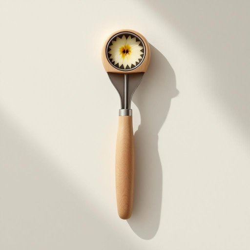

# corer

<h1 style="font-size: 2.5em; font-weight: 300; letter-spacing: 2px; margin: 0; color: #2c3e50;">
/corer*/
</h1>

---

---

## 例句

Before we start baking the apple pie, could you please pass me the corer from the drawer, the one with the comfortable grip and sharp edges, so that I can quickly and neatly remove the cores without bruising the fruit or wasting any of the juicy flesh?

*Before(/ˌbiˈfɔr/) we(/wi/) start(/stɑrt/) baking(/ˈbeɪkɪŋ/) the(/ðə/) apple(/ˈæpəl/) pie,(/paɪ,/) could(/kʊd/) you(/ju/) please(/pliz/) pass(/pæs/) me(/mi/) the(/ðə/) corer(/corer*/) from(/frəm/) the(/ðə/) drawer,(/drɔr,/) the(/ðə/) one(/wən/) with(/wɪθ/) the(/ðə/) comfortable(/ˈkəmfərtəbəl/) grip(/grɪp/) and(/ənd/) sharp(/ʃɑrp/) edges,(/ˈɛʤɪz,/) so(/soʊ/) that(/ðət/) I(/aɪ/) can(/kən/) quickly(/kˈwɪkli/) and(/ənd/) neatly(/ˈnitli/) remove(/riˈmuv/) the(/ðə/) cores(/kɔrz/) without(/wɪˈθaʊt/) bruising(/ˈbruzɪŋ/) the(/ðə/) fruit(/frut/) or(/ər/) wasting(/ˈweɪstɪŋ/) any(/ˈɛni/) of(/əv/) the(/ðə/) juicy(/ˈʤusi/) flesh?(/flɛʃ?/)*

**翻译：** 在我们开始烤苹果派之前，能否请你从抽屉里递给我那个带有舒适握柄和锋利刃口的去核器，这样我就能迅速而整洁地去除果核，既不弄伤果肉，也不会浪费多汁的果肉。

---

## 解释

英语单词“corer”作为名词，在家居生活用品场景中指的是一种专门用来去除水果（尤其是苹果、梨、菠萝等）果核的小工具或厨房用具。具体使用场合通常是在准备水果时，为了方便食用或制作甜点，使用corer可以快速而整齐地去掉果核，节省人工操作时间。对于英语学习者来说，corer是可数名词，常见搭配包括“apple corer”（苹果去核器）、“fruit corer”（水果去核器），一般放置在厨房用具或餐具分类中，语法上需要注意其作为工具名词的单复数变化，如one corer, two corers等。该词来源于动词“core”，意思是去除果核，加上名词后缀“-er”表示执行该动作的工具，体现出英语中常见的动词派生为工具名词的规律。在中文语境中，“corer”准确的翻译为“去核器”或“果核去除器”，使用时往往指小型的便携式厨房用具，无特殊褒贬含义，属于实用型工具词汇，没有特别的文化色彩或隐含意义，仅强调其功能性。

---

<small style="color: #999; font-size: 0.9em;">2025-07-17 06:22:39</small>

