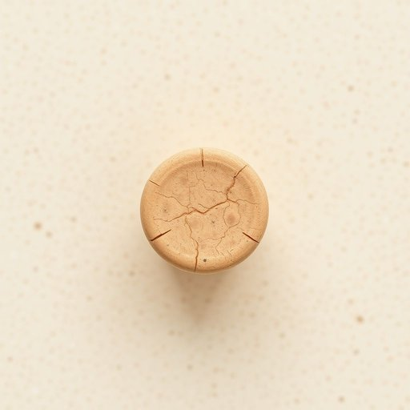

# cork

<h1 style="font-size: 2.5em; font-weight: 300; letter-spacing: 2px; margin: 0; color: #2c3e50;">
/kɔrk/
</h1>

---

---

## 例句

Could you please pass me the cork from the wine bottle opener drawer, the one with the slightly chipped edge that we use not only to seal bottles but also for the DIY bulletin board in the kitchen, since it’s perfect for pinning recipes and important reminders without damaging the walls?

*Could(/kʊd/) you(/ju/) please(/pliz/) pass(/pæs/) me(/mi/) the(/ðə/) cork(/kɔrk/) from(/frəm/) the(/ðə/) wine(/waɪn/) bottle(/ˈbɑtəl/) opener(/ˈoʊpənər/) drawer,(/drɔr,/) the(/ðə/) one(/wən/) with(/wɪθ/) the(/ðə/) slightly(/sˈlaɪtli/) chipped(/ʧɪpt/) edge(/ɛʤ/) that(/ðət/) we(/wi/) use(/juz/) not(/nɑt/) only(/ˈoʊnli/) to(/tɪ/) seal(/sil/) bottles(/ˈbɑtəlz/) but(/bət/) also(/ˈɔlsoʊ/) for(/fər/) the(/ðə/) DIY(/diy*/) bulletin(/ˈbʊlɪtən/) board(/bɔrd/) in(/ɪn/) the(/ðə/) kitchen,(/ˈkɪʧən,/) since(/sɪns/) it’s(/it’s*/) perfect(/ˈpərˌfɪkt/) for(/fər/) pinning(/ˈpɪnɪŋ/) recipes(/ˈrɛsəpiz/) and(/ənd/) important(/ˌɪmˈpɔrtənt/) reminders(/riˈmaɪndərz/) without(/wɪˈθaʊt/) damaging(/ˈdæmɪʤɪŋ/) the(/ðə/) walls?(/wɔlz?/)*

**翻译：** 你能帮我从开酒器的抽屉里拿一下那个瓶塞吗？就是那个边缘略微有些崩缺的，我们不仅用它来封瓶子，还用它做厨房里的自制公告板，因为它非常适合贴菜谱和重要提醒，而且不会损坏墙壁。

---

## 解释

“cork”作为名词在家居生活用品场景中主要指由软木树皮制成的材料或制品，常见于瓶塞、桌垫、墙板或地垫等用途，尤其以软木塞用于葡萄酒瓶封口最为典型。具体使用场合通常涉及封瓶、保鲜、隔音、防震以及装饰等方面，如“a cork stopper”（软木塞）或“a cork board”（软木留言板）。英语学习者应注意，“cork”作为可数名词时常指具体的软木塞，而作为不可数名词则泛指软木材料本身。在搭配上，常见表达有“cork bottle stopper”、“cork mat”、“cork floor”等，强调材质或用途。此外，cork作名词时通常不带复数形式“corks”指材料，但指多个软木塞时可用复数。词源方面，“cork”来自中古英语，源自古法语“corque”，再源自拉丁语“cortex”，意为“树皮”，反映其软木树皮的天然来源。这一词汇在中文语境中准确翻译为“软木”或“软木塞”，在家居用品领域中常用“软木制品”或“软木塞”，表示自然环保材料，且无褒贬色彩，属于中性词汇，带有一定的生态环保和天然质感的文化含义，符合当代绿色生活理念。

---

<small style="color: #999; font-size: 0.9em;">2025-07-17 06:22:39</small>

