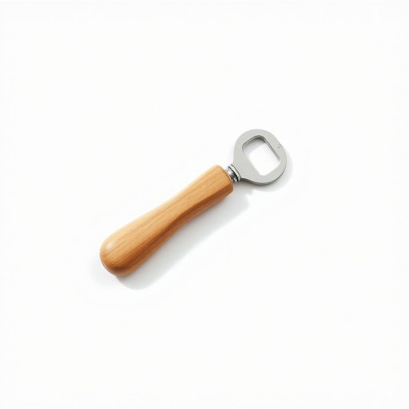

# corkscrew

<h1 style="font-size: 2.5em; font-weight: 300; letter-spacing: 2px; margin: 0; color: #2c3e50;">
/ˈkɔrkˌskru/
</h1>

---

---

## 例句

Could you please pass me the corkscrew that’s usually kept in the drawer next to the cutlery tray, the one with the wooden handle and the small foil cutter, because I’m struggling to open this bottle of wine without it?

*Could(/kʊd/) you(/ju/) please(/pliz/) pass(/pæs/) me(/mi/) the(/ðə/) corkscrew(/ˈkɔrkˌskru/) that’s(/that’s*/) usually(/ˈjuʒəwəli/) kept(/kɛpt/) in(/ɪn/) the(/ðə/) drawer(/drɔr/) next(/nɛkst/) to(/tɪ/) the(/ðə/) cutlery(/ˈkətləri/) tray,(/treɪ,/) the(/ðə/) one(/wən/) with(/wɪθ/) the(/ðə/) wooden(/ˈwʊdən/) handle(/ˈhændəl/) and(/ənd/) the(/ðə/) small(/smɔl/) foil(/fɔɪl/) cutter,(/ˈkətər,/) because(/bɪˈkəz/) I’m(/i’m*/) struggling(/ˈstrəgəlɪŋ/) to(/tɪ/) open(/ˈoʊpən/) this(/ðɪs/) bottle(/ˈbɑtəl/) of(/əv/) wine(/waɪn/) without(/wɪˈθaʊt/) it?(/ɪt?/)*

**翻译：** 请您把那个通常放在餐具盒旁边抽屉里的开瓶器递给我好吗？就是那个带木柄和小剪刀的开瓶器，因为没有它我很难打开这瓶酒。

---

## 解释

“corkscrew”作为家居生活用品中的名词，指的是开瓶器，特别是用于拔除软木塞的工具，常见于家庭厨房和餐厅场景，尤其在开葡萄酒瓶时使用。这一器具一般由一个螺旋形的金属杆和一个手柄组成，便于旋入并拽出软木塞。英语学习者在使用“corkscrew”时需注意，它是可数名词，复数形式为“corkscrews”，常见搭配包括“use a corkscrew”（使用开瓶器）、“an old-fashioned corkscrew”（老式开瓶器）等，且常与“bottle”（瓶子）、“wine”（葡萄酒）一同出现。此外，短语“corkscrew motion”也用来描述螺旋形运动，但此时为比喻用法。词源上，“corkscrew”源自“cork”（软木塞）与“screw”（螺丝）的组合，反映了该工具通过螺旋结构来拔出瓶塞的功能。在中文语境中，“corkscrew”准确翻译为“开瓶器”或“螺旋开瓶器”，强调其专门针对软木塞的用途，没有贬义或特殊褒义，属于实用工具词汇。总体而言，该词的使用较为直接，文化内涵朴实，理解时应结合酒类文化背景，避免与其他类型的开瓶工具混淆。

---

<small style="color: #999; font-size: 0.9em;">2025-07-17 06:22:39</small>

