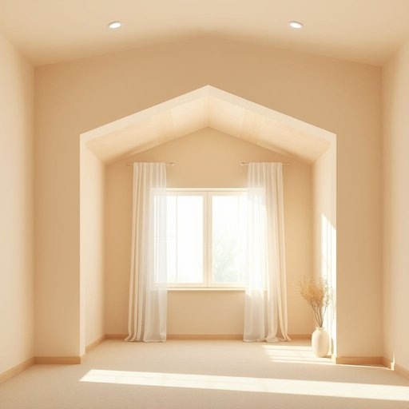

# cornice

<h1 style="font-size: 2.5em; font-weight: 300; letter-spacing: 2px; margin: 0; color: #2c3e50;">
/cornice*/
</h1>

---

---

## 例句

Could you help me decide whether the new curtains will look better hanging beneath the ornate cornice that frames the bay window, or if we should replace the entire cornice first to match the modern aesthetic we’re aiming for in the living room?

*Could(/kʊd/) you(/ju/) help(/hɛlp/) me(/mi/) decide(/ˌdɪˈsaɪd/) whether(/ˈwɛðər/) the(/ðə/) new(/nu/) curtains(/ˈkərtənz/) will(/wɪl/) look(/lʊk/) better(/ˈbɛtər/) hanging(/ˈhæŋɪŋ/) beneath(/bɪˈniθ/) the(/ðə/) ornate(/ɔrˈneɪt/) cornice(/cornice*/) that(/ðət/) frames(/freɪmz/) the(/ðə/) bay(/beɪ/) window,(/ˈwɪndoʊ,/) or(/ər/) if(/ɪf/) we(/wi/) should(/ʃʊd/) replace(/ˌriˈpleɪs/) the(/ðə/) entire(/ɪnˈtaɪər/) cornice(/cornice*/) first(/fərst/) to(/tɪ/) match(/mæʧ/) the(/ðə/) modern(/ˈmɑdərn/) aesthetic(/ɛsˈθɛtɪk/) we’re(/we’re*/) aiming(/ˈeɪmɪŋ/) for(/fər/) in(/ɪn/) the(/ðə/) living(/ˈlɪvɪŋ/) room?(/rum?/)*

**翻译：** 你能帮我决定一下是把新窗帘挂在装饰华丽的阳台窗檐下更好，还是我们应该先更换整个窗檐，以配合客厅追求的现代美学风格？

---

## 解释

英语单词cornice在家居生活用品的语境中，作为名词指的是装饰性梁檐或窗帘盒，通常用于墙顶与天花板交接处的装饰线条，亦可指悬挂窗帘时固定窗帘杆的装饰板。如在家居装修或室内设计中，人们会说install a cornice around the ceiling表示在天花板周围安装装饰线条，或a cornice above the window指窗户上方的装饰板。学习者需要注意的是，cornice作为可数名词，通常搭配介词on、around或above，且多用于复数形式cornices来描述多个装饰线条或边缘。此外，cornice也可以用作地理或气象术语，但在家居语境须避免混淆。该词源自拉丁语cornix，意为角、边缘，通过意大利语cornice进入英语，最初指建筑上的飞檐或檐口装饰，反映了其作为装饰边缘的功能。在中文中，cornice常译为檐口装饰线或墙顶装饰板，用于家居装修时理解为起装饰和隐藏接缝、固定窗帘杆的功能性美观构件。该词本身无褒贬色彩，但多用于正式或专业的建筑装饰语境，体现优雅和精致的空间设计感。

---

<small style="color: #999; font-size: 0.9em;">2025-07-17 06:22:39</small>

