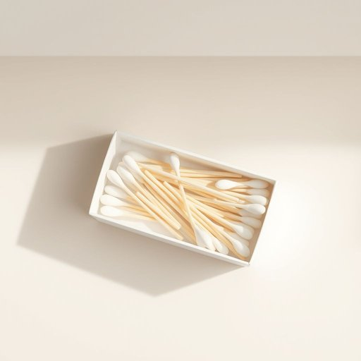

# cotton-bud

<h1 style="font-size: 2.5em; font-weight: 300; letter-spacing: 2px; margin: 0; color: #2c3e50;">
/cotton-bud*/
</h1>

---

---

## 例句

When I was tidying up the bathroom cabinet, I noticed that the box of cotton-buds, which I usually use not only for cleaning my ears but also for applying makeup and touching up small paint spots around the house, was almost empty, so I made a mental note to add a new pack to the shopping list before our guests arrive this weekend.

*When(/wɪn/) I(/aɪ/) was(/wɑz/) tidying(/tidying*/) up(/əp/) the(/ðə/) bathroom(/ˈbæθˌrum/) cabinet,(/ˈkæbənət,/) I(/aɪ/) noticed(/ˈnoʊtɪst/) that(/ðət/) the(/ðə/) box(/bɑks/) of(/əv/) cotton-buds,(/cotton-buds*,/) which(/wɪʧ/) I(/aɪ/) usually(/ˈjuʒəwəli/) use(/juz/) not(/nɑt/) only(/ˈoʊnli/) for(/fər/) cleaning(/ˈklinɪŋ/) my(/maɪ/) ears(/ɪrz/) but(/bət/) also(/ˈɔlsoʊ/) for(/fər/) applying(/əˈplaɪɪŋ/) makeup(/ˈmeɪˌkəp/) and(/ənd/) touching(/ˈtəʧɪŋ/) up(/əp/) small(/smɔl/) paint(/peɪnt/) spots(/spɑts/) around(/əraʊnd/) the(/ðə/) house,(/haʊs,/) was(/wɑz/) almost(/ˈɔlˌmoʊst/) empty,(/ˈɛmti,/) so(/soʊ/) I(/aɪ/) made(/meɪd/) a(/ə/) mental(/ˈmɛntəl/) note(/noʊt/) to(/tɪ/) add(/æd/) a(/ə/) new(/nu/) pack(/pæk/) to(/tɪ/) the(/ðə/) shopping(/ˈʃɑpɪŋ/) list(/lɪst/) before(/ˌbiˈfɔr/) our(/ɑr/) guests(/gɛsts/) arrive(/əraɪv/) this(/ðɪs/) weekend.(/ˈwiˌkɪnd./)*

**翻译：** 当我整理浴室柜时，注意到那盒棉签几乎用尽了。平时我不仅用它清洁耳朵，还用来化妆和修补家中细小的油漆斑点。于是我在心里记下，等客人本周末来之前要把新包装的棉签加入购物清单。

---

## 解释

英语单词“cotton-bud”作为名词，主要指一种家居生活用品，即用于清洁耳朵或进行细微擦拭的小棒，棒的一端或两端缠绕有棉花棒头。具体使用场合通常是在家庭卫生、个人护理或化妆时，比如用来清理耳道、涂抹药膏、修饰指甲边缘等，这种物品也常见于药房和化妆包中。英语学习者在使用“cotton-bud”时需注意其复数形式为“cotton-buds”，此外该词常与动词“use”，“clean”，“apply”等搭配，如“use a cotton-bud to clean your ears”或“apply ointment with a cotton-bud”，同时在英式英语中“cotton-bud”更为常用，而美式英语更倾向于使用“cotton swab”或“Q-tip”（Q-tip为品牌名，逐渐泛指此类产品）。词源方面，“cotton”指棉花，而“bud”意为花蕾，形象地描述了棉花包裹形成的小头的形状，起源于19世纪后期。中文语境中，“cotton-bud”准确翻译为“棉签”，这是最贴切且普遍接受的表达，强调的是其作为日常生活中细致清洁工具的属性。该词本身无明显的褒贬色彩或特殊文化内涵，属于中性词汇，使用时只需注意与具体清洁行为的搭配即可避免歧义。

---

<small style="color: #999; font-size: 0.9em;">2025-07-17 06:22:39</small>

