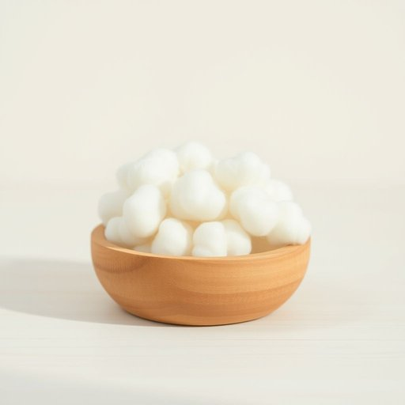

# cotton-wool

<h1 style="font-size: 2.5em; font-weight: 300; letter-spacing: 2px; margin: 0; color: #2c3e50;">
/cotton-wool*/
</h1>

---

---

## 例句

Could you please check if there's enough cotton-wool in the bathroom cabinet, as I need some to properly clean the small scratch on the baby's arm without causing irritation, especially since the antiseptic cream requires gentle application with soft materials?

*Could(/kʊd/) you(/ju/) please(/pliz/) check(/ʧɛk/) if(/ɪf/) there's(/ðɛrz/) enough(/ɪˈnəf/) cotton-wool(/cotton-wool*/) in(/ɪn/) the(/ðə/) bathroom(/ˈbæθˌrum/) cabinet,(/ˈkæbənət,/) as(/ɛz/) I(/aɪ/) need(/nid/) some(/səm/) to(/tɪ/) properly(/ˈprɑpərli/) clean(/klin/) the(/ðə/) small(/smɔl/) scratch(/skræʧ/) on(/ɔn/) the(/ðə/) baby's(/ˈbeɪbiz/) arm(/ɑrm/) without(/wɪˈθaʊt/) causing(/ˈkɔzɪŋ/) irritation,(/ˌɪrɪˈteɪʃən,/) especially(/əˈspɛʃəli/) since(/sɪns/) the(/ðə/) antiseptic(/ˌæntəˈsɛptɪk/) cream(/krim/) requires(/rikˈwaɪərz/) gentle(/ˈʤɛnəl/) application(/ˌæpləˈkeɪʃən/) with(/wɪθ/) soft(/sɔft/) materials?(/məˈtɪriəlz?/)*

**翻译：** 请您帮忙检查一下浴室柜里是否有足够的棉花，因为我需要用棉花轻柔地清洁宝宝手臂上的小划痕，避免刺激，尤其是消毒药膏需要用柔软的材料轻轻涂抹。

---

## 解释

“cotton-wool”作为名词在家居生活用品的英语语境中，通常指的是一种由棉花制成的柔软而蓬松的材料，广泛用于清洁、包扎、护肤和化妆等场合。例如，在处理轻微伤口时，人们常用cotton-wool来吸收液体或保护皮肤，或用作婴儿护理中的柔软垫料。英语学习者在使用cotton-wool时应注意它通常作为不可数名词出现，很少用复数形式，且常见搭配有“a piece of cotton-wool”（一团棉花）或“some cotton-wool”（一些棉花）；此外，该词多用于具体的物理材料描述，不能用来隐喻或抽象描述。cotton-wool这一词源自“cotton”（棉花）与“wool”（羊毛）的结合，形象地描绘了这种材料的质地像羊毛般绵软和蓬松，其起源可追溯至工业革命后棉制品的广泛使用。中文中，cotton-wool通常译为“棉花”或“棉絮”，在医疗或家用环境下亦可译为“棉球”或“棉垫”，强调其柔软吸水的特性。该词本身无明显褒贬含义，但在某些比喻用法中，cotton-wool可能带有“过度保护”或“娇嫩”的贬义色彩，但在家居生活用品语境中仅指具体物品，文化内涵较为中性。

---

<small style="color: #999; font-size: 0.9em;">2025-07-17 06:22:39</small>

