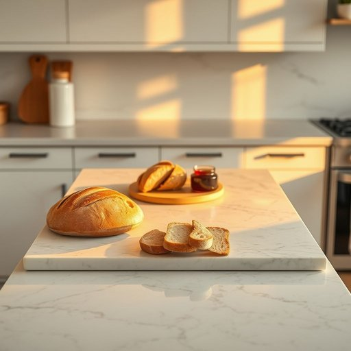

# counter

<h1 style="font-size: 2.5em; font-weight: 300; letter-spacing: 2px; margin: 0; color: #2c3e50;">
/ˈkaʊntər/
</h1>

---

---

## 例句

While I was preparing dinner in the kitchen, which was flooded with the warm glow of the evening sun, I carefully wiped down the marble counter that, despite its sleek appearance, had stubborn stains from last night's cooking, making sure it was spotless before setting out the freshly baked bread and homemade jam for breakfast.

*While(/waɪl/) I(/aɪ/) was(/wɑz/) preparing(/pərˈpɛrɪŋ/) dinner(/ˈdɪnər/) in(/ɪn/) the(/ðə/) kitchen,(/ˈkɪʧən,/) which(/wɪʧ/) was(/wɑz/) flooded(/ˈflədɪd/) with(/wɪθ/) the(/ðə/) warm(/wɔrm/) glow(/gloʊ/) of(/əv/) the(/ðə/) evening(/ˈivnɪŋ/) sun,(/sən,/) I(/aɪ/) carefully(/ˈkɛrfəli/) wiped(/waɪpt/) down(/daʊn/) the(/ðə/) marble(/ˈmɑrbəl/) counter(/ˈkaʊntər/) that,(/ðət,/) despite(/dɪˈspaɪt/) its(/ɪts/) sleek(/slik/) appearance,(/əˈpɪrəns,/) had(/hæd/) stubborn(/ˈstəbərn/) stains(/steɪnz/) from(/frəm/) last(/læst/) night's(/naɪts/) cooking,(/ˈkʊkɪŋ,/) making(/ˈmeɪkɪŋ/) sure(/ʃʊr/) it(/ɪt/) was(/wɑz/) spotless(/ˈspɑtləs/) before(/ˌbiˈfɔr/) setting(/ˈsɛtɪŋ/) out(/aʊt/) the(/ðə/) freshly(/ˈfrɛʃli/) baked(/beɪkt/) bread(/brɛd/) and(/ənd/) homemade(/ˈhoʊˈmeɪd/) jam(/ʤæm/) for(/fər/) breakfast.(/ˈbrɛkfəst./)*

**翻译：** 当我在厨房准备晚餐时，夕阳的温暖光辉洒满整个空间，我细心地擦拭着大理石台面。尽管它外观光滑，但由于昨晚烹饪留下了顽固的污渍，我确保将其擦拭得一尘不染，然后才摆上新鲜出炉的面包和自制果酱，为早餐做好准备。

---

## 解释

在家居生活用品的语境中，英语单词“counter”作为名词通常指厨房中的操作台面或柜台，这是一种平坦的表面，用于放置食材、烹饪器具或准备餐点，常见于厨房、餐厅或零售场所。具体使用场合如“kitchen counter”（厨房台面）、“store counter”（商店柜台）等，语义明确且具象。英语学习者在使用“counter”时应注意其名词属性，可数名词，复数形式为“counters”，常见搭配包括“kitchen counter”、“counter space”、“counter top”等；语法上通常作主语、宾语，或用作介词短语的中心词。此外，“counter”在作为名词时不能与动词混淆，且避免与形容词性用法“counterproductive”等混用。此词源自中古英语“countour”或古法语“contre”，意为“对立面”或“桌面”，其现代含义演变为“柜台”、“操作台”，反映了物理位置的功能属性。在中文语境中，“counter”在家居生活用品中准确翻译为“台面”、“操作台”或“柜台”，强调其作为工作平面或交易窗口的功能，避免误译为“计数器”或“反对者”等其他含义。整体来看，作为家居用品名词的“counter”较为中性，无特殊褒贬色彩，但在不同场合下词义和功能会有所侧重，学习时应结合具体语境理解和使用，确保表达的准确性与自然性。

---

<small style="color: #999; font-size: 0.9em;">2025-07-17 06:22:39</small>

