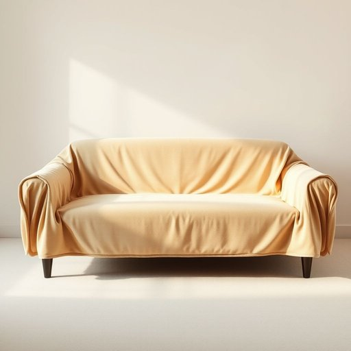

# cover

<h1 style="font-size: 2.5em; font-weight: 300; letter-spacing: 2px; margin: 0; color: #2c3e50;">
/ˈkəvər/
</h1>

---

---

## 例句

Could you please check if the sofa cover, which we bought last autumn to protect the cushions from the inevitable tea spills and pet hair, is still in the laundry basket, or has the sofa cover been misplaced somewhere else in the living room?

*Could(/kʊd/) you(/ju/) please(/pliz/) check(/ʧɛk/) if(/ɪf/) the(/ðə/) sofa(/ˈsoʊfə/) cover,(/ˈkəvər,/) which(/wɪʧ/) we(/wi/) bought(/bɔt/) last(/læst/) autumn(/ˈɔtəm/) to(/tɪ/) protect(/prəˈtɛkt/) the(/ðə/) cushions(/ˈkʊʃənz/) from(/frəm/) the(/ðə/) inevitable(/ˌɪˈnɛvətəbəl/) tea(/ti/) spills(/spɪlz/) and(/ənd/) pet(/pɛt/) hair,(/hɛr,/) is(/ɪz/) still(/stɪl/) in(/ɪn/) the(/ðə/) laundry(/ˈlɔndri/) basket,(/ˈbæskət,/) or(/ər/) has(/həz/) the(/ðə/) sofa(/ˈsoʊfə/) cover(/ˈkəvər/) been(/bɪn/) misplaced(/mɪˈspleɪst/) somewhere(/ˈsəmˌwɛr/) else(/ɛls/) in(/ɪn/) the(/ðə/) living(/ˈlɪvɪŋ/) room?(/rum?/)*

**翻译：** 请您帮忙确认一下，我们去年秋天买来用以防止茶渍和宠物毛发弄脏靠垫的沙发套，是不是还放在洗衣篮里，或者是不是被放错地方了，散落在客厅的其他角落？

---

## 解释

在家居生活用品的语境中，英语单词“cover”作为名词通常指用来覆盖或保护家具、床铺、餐桌等物品的覆盖物，如床罩、沙发套、枕套或桌布等。具体使用场合多见于描述家居装饰或保护用品时，例如“a duvet cover”（被套）、“a sofa cover”（沙发罩）、“a pillow cover”（枕套）。学习者在使用“cover”作为名词时应注意，它与动词“to cover”不同，作为名词时通常需要与具体物品名称组合构成复合名词表示具体的覆盖物或罩子，且多为可数名词。常见的搭配还包括“protective cover”（保护罩）、“plastic cover”（塑料罩）等，表达时宜根据具体物品选用合适的修饰词。此外，“cover”在家居生活语境中多为中性词，无明显褒贬色彩，但在搭配上可体现美观或实用性的侧重点。词源方面，“cover”源自古法语“covrir”，继承自拉丁语“cooperire”，意为“盖上”“遮盖”，这体现了其作为名词时覆盖、保护的基本功能。中文语境中，“cover”应准确译为“罩”“套”“盖子”“覆盖物”等，根据具体物品确定最贴切的译法，避免误用为动词“覆盖”的意思。总体而言，“cover”作为名词在家居用品领域是一个非常常用且实用的词汇，理解和使用时需结合具体语境及搭配习惯，确保表达准确而自然。

---

<small style="color: #999; font-size: 0.9em;">2025-07-17 06:22:39</small>

