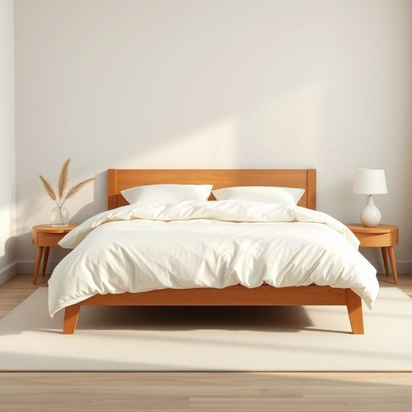

# coverlet

<h1 style="font-size: 2.5em; font-weight: 300; letter-spacing: 2px; margin: 0; color: #2c3e50;">
/coverlet*/
</h1>

---

---

## 例句

Could you please help me straighten the coverlet on the guest bed before our friends arrive this evening, making sure that it’s neatly tucked in at the sides and smoothed out to avoid any wrinkles, since it’s the only decorative piece that really ties the whole room together?

*Could(/kʊd/) you(/ju/) please(/pliz/) help(/hɛlp/) me(/mi/) straighten(/ˈstreɪtən/) the(/ðə/) coverlet(/coverlet*/) on(/ɔn/) the(/ðə/) guest(/gɛst/) bed(/bɛd/) before(/ˌbiˈfɔr/) our(/ɑr/) friends(/frɛndz/) arrive(/əraɪv/) this(/ðɪs/) evening,(/ˈivnɪŋ,/) making(/ˈmeɪkɪŋ/) sure(/ʃʊr/) that(/ðət/) it’s(/it’s*/) neatly(/ˈnitli/) tucked(/təkt/) in(/ɪn/) at(/æt/) the(/ðə/) sides(/saɪdz/) and(/ənd/) smoothed(/smuðd/) out(/aʊt/) to(/tɪ/) avoid(/əˈvɔɪd/) any(/ˈɛni/) wrinkles,(/ˈrɪŋkəlz,/) since(/sɪns/) it’s(/it’s*/) the(/ðə/) only(/ˈoʊnli/) decorative(/ˈdɛkrətɪv/) piece(/pis/) that(/ðət/) really(/ˈrɪli/) ties(/taɪz/) the(/ðə/) whole(/hoʊl/) room(/rum/) together?(/təˈgɛðər?/)*

**翻译：** 请您在今晚朋友们到来之前帮忙把客床上的床罩整理一下，确保两侧收得整整齐齐，表面平整无皱纹，因为它是唯一真正能把整个房间装饰得协调统一的装饰品。

---

## 解释

英语单词"coverlet"作为名词，在家居生活用品的语境中，指的是一种轻薄的床上覆盖物，通常用来装饰床铺或提供适度的保暖，常见于卧室中作为床罩或细棉被使用，适合春秋季节或温暖环境下使用。学习者在使用"coverlet"时需注意其为可数名词，常用复数形式"coverlets"表示多件覆盖物，常见搭配包括"bed coverlet"（床盖）、"woven coverlet"（织物床罩）、"decorative coverlet"（装饰性床罩）等，此外，"coverlet"大多用于美式英语中，在英式英语中可能较少使用，常用词汇"bedspread"或"quilt"更为普遍，语法上作为名词使用时不具备其他词性变化，且通常与介词"in"、"on"连用，如"put a coverlet on the bed"。该词源自中古英语"coverlet"，源自"cover"（覆盖）与后缀"-let"（表示小物），原意即“小型覆盖物”，体现其尺寸较薄且轻便的特点。在中文语境中，"coverlet"准确对应的翻译为“床盖”或“薄被”，强调其作为铺于床面、兼具装饰与轻度保暖功能的家用织物，与厚重的棉被或毯子不同。此词本身无褒贬色彩，主要侧重实用及装饰意义，常见于家居用品、室内装饰或床上用品领域，知晓其细微区别有助于语言学习者更准确地描述家庭卧室环境及床上用品种类。

---

<small style="color: #999; font-size: 0.9em;">2025-07-17 06:22:39</small>

