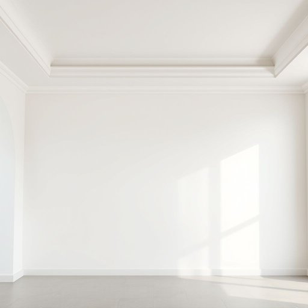

# coving

<h1 style="font-size: 2.5em; font-weight: 300; letter-spacing: 2px; margin: 0; color: #2c3e50;">
/coving*/
</h1>

---

---

## 例句

Before we decide on the paint colour for the living room, we should carefully examine the coving, which, despite being originally quite ornate and crafted from plaster, has suffered some cracks over time and therefore might require professional restoration or possibly complete replacement to maintain the period charm of the house.

*Before(/ˌbiˈfɔr/) we(/wi/) decide(/ˌdɪˈsaɪd/) on(/ɔn/) the(/ðə/) paint(/peɪnt/) colour(/ˈkələr/) for(/fər/) the(/ðə/) living(/ˈlɪvɪŋ/) room,(/rum,/) we(/wi/) should(/ʃʊd/) carefully(/ˈkɛrfəli/) examine(/ɪgˈzæmɪn/) the(/ðə/) coving,(/coving*,/) which,(/wɪʧ,/) despite(/dɪˈspaɪt/) being(/biɪŋ/) originally(/ərˈɪʤənəli/) quite(/kwaɪt/) ornate(/ɔrˈneɪt/) and(/ənd/) crafted(/ˈkræftɪd/) from(/frəm/) plaster,(/ˈplæstər,/) has(/həz/) suffered(/ˈsəfərd/) some(/səm/) cracks(/kræks/) over(/ˈoʊvər/) time(/taɪm/) and(/ənd/) therefore(/ˈðɛrˌfɔr/) might(/maɪt/) require(/ˌrikˈwaɪər/) professional(/prəˈfɛʃənəl/) restoration(/ˌrɛstərˈeɪʃən/) or(/ər/) possibly(/ˈpɑsəbli/) complete(/kəmˈplit/) replacement(/rɪˈpleɪsmənt/) to(/tɪ/) maintain(/meɪnˈteɪn/) the(/ðə/) period(/ˈpɪriəd/) charm(/ʧɑrm/) of(/əv/) the(/ðə/) house.(/haʊs./)*

**翻译：** 在我们决定客厅的油漆颜色之前，应仔细检查天花板的檐口线条。尽管它最初相当华丽，由石膏制作，但随着时间推移出现了一些裂缝，因此可能需要专业修复，或甚至彻底更换，以保持房屋的时代韵味。

---

## 解释

“coving”作为名词在家居生活用品领域主要指室内墙壁与天花板之间的弧形或斜角装饰线条，用于遮盖拐角处的缝隙或实现装饰效果，常见于吊顶、壁脚线等装修细节场合。英语学习者在使用“coving”时应注意，它通常是不可数名词，多用单数形式，且常与表示位置的词搭配，如“ceiling coving”（天花板装饰线）、“cornice coving”（檐口装饰线）；表达时可用“install coving”表示安装，或“decorative coving”表示装饰性。语法上，作为名词使用时一般不直接加复数形式“covings”，尽管有时口语中可见，但不规范。词源方面，“coving”源自古英语“cove”意为“凹处、拱形”，引申为墙角弧形装饰，反映了其圆弧形结构的设计理念。在中文语境中，“coving”准确翻译为“墙角线条”或“弧形装饰线”，强调其主要功能是连接墙面与天花板，使过渡更为平滑美观，无特殊褒贬含义，是室内装修中常见且实用的细节工艺。整体来看，该词为专业建筑与装修语汇，使用时注重搭配和具体场所描述，有助于准确传达室内设计风格与结构特征。

---

<small style="color: #999; font-size: 0.9em;">2025-07-17 06:22:39</small>

