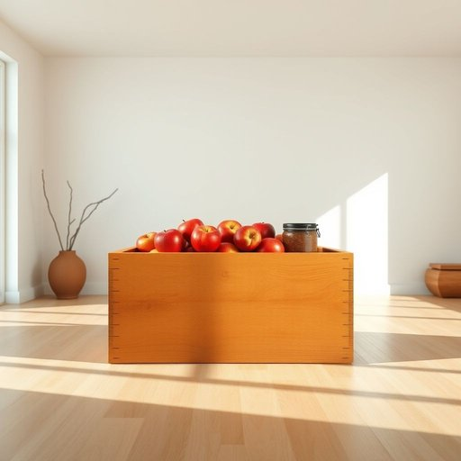

# crate

<h1 style="font-size: 2.5em; font-weight: 300; letter-spacing: 2px; margin: 0; color: #2c3e50;">
/kreɪt/
</h1>

---

---

## 例句

After unpacking the groceries, she carefully placed the fresh apples and homemade preserves into a sturdy wooden crate, which she planned to repurpose as a stylish storage unit for her living room, demonstrating both practicality and eco-consciousness in her home organization.

*After(/ˈæftər/) unpacking(/ənˈpækɪŋ/) the(/ðə/) groceries,(/ˈgroʊsəriz,/) she(/ʃi/) carefully(/ˈkɛrfəli/) placed(/pleɪst/) the(/ðə/) fresh(/frɛʃ/) apples(/ˈæpəlz/) and(/ənd/) homemade(/ˈhoʊˈmeɪd/) preserves(/prɪˈzərvz/) into(/ˈɪntu/) a(/ə/) sturdy(/ˈstərdi/) wooden(/ˈwʊdən/) crate,(/kreɪt,/) which(/wɪʧ/) she(/ʃi/) planned(/plænd/) to(/tɪ/) repurpose(/repurpose*/) as(/ɛz/) a(/ə/) stylish(/ˈstaɪlɪʃ/) storage(/ˈstɔrɪʤ/) unit(/ˈjunɪt/) for(/fər/) her(/hər/) living(/ˈlɪvɪŋ/) room,(/rum,/) demonstrating(/ˈdɛmənˌstreɪtɪŋ/) both(/boʊθ/) practicality(/ˌpræktɪˈkæləti/) and(/ənd/) eco-consciousness(/eco-consciousness*/) in(/ɪn/) her(/hər/) home(/hoʊm/) organization.(/ˌɔrgənəˈzeɪʃən./)*

**翻译：** 将杂货拆包后，她小心翼翼地将新鲜的苹果和自制的果酱放入一个坚固的木箱中，计划将其改造为客厅中既实用又富有格调的储物单元，展现出她在家居整理中兼顾实用性与环保意识的用心。

---

## 解释

英语单词“crate”作为名词在家居生活用品的语境中，通常指的是一种用木头、塑料或金属制成的箱子或框架，用于存放、运输或整理物品，如水果、蔬菜、瓶子或杂物。具体使用场合包括搬家时用来装东西，家中用于存放玩具或工具，或用于园艺时装载土壤和植物等。英语学习者使用“crate”时应注意其作为可数名词，需要与冠词或数词搭配，如“a crate”、“two crates”，且常见搭配包括“wooden crate”（木箱）、“plastic crate”（塑料箱）、“shipping crate”（运输箱）等，可与动词“fill”、“stack”、“carry”等搭配表达“装满箱子”、“堆放箱子”、“搬运箱子”的意思。词源方面，“crate”源自拉丁语“cratis”，意为编织的篮子或框架，经过中古拉丁语演变至古法语再进入英语，反映了早期以编织材料制作容器的传统。中文语境中，“crate”通常准确翻译为“箱子”或“板条箱”，强调其结构坚固且多用于搬运和存储，不同于一般的“盒子”或“箱”更侧重于粗糙、实用的容器。该词本身无褒贬色彩，属于中性词汇，文化上隐含对工业、运输或乡村生活场景的关联，且因其功能性，常见于物流、仓储及家居收纳等实际应用中。

---

<small style="color: #999; font-size: 0.9em;">2025-07-17 06:22:39</small>

