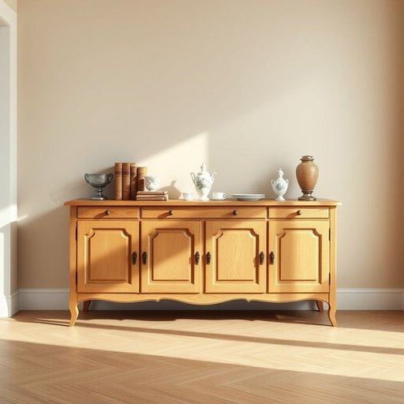

# credenza

<h1 style="font-size: 2.5em; font-weight: 300; letter-spacing: 2px; margin: 0; color: #2c3e50;">
/krəˈdɛnzə/
</h1>

---

---

## 例句

After moving into our new flat, I decided to place the antique credenza, which we inherited from my grandmother and had lovingly restored by a local craftsman, against the dining room wall, not only to store fine china and silverware but also to display a collection of vintage books and delicate porcelain figurines that add a touch of character and history to the otherwise modern space.

*After(/ˈæftər/) moving(/ˈmuvɪŋ/) into(/ˈɪntu/) our(/ɑr/) new(/nu/) flat,(/flæt,/) I(/aɪ/) decided(/ˌdɪˈsaɪdɪd/) to(/tɪ/) place(/pleɪs/) the(/ðə/) antique(/ænˈtik/) credenza,(/krəˈdɛnzə,/) which(/wɪʧ/) we(/wi/) inherited(/ˌɪnˈhɛrətɪd/) from(/frəm/) my(/maɪ/) grandmother(/ˈgrændˌməðər/) and(/ənd/) had(/hæd/) lovingly(/ˈləvɪŋli/) restored(/rɪˈstɔrd/) by(/baɪ/) a(/ə/) local(/ˈloʊkəl/) craftsman,(/ˈkræftsmən,/) against(/əˈgɛnst/) the(/ðə/) dining(/ˈdaɪnɪŋ/) room(/rum/) wall,(/wɔl,/) not(/nɑt/) only(/ˈoʊnli/) to(/tɪ/) store(/stɔr/) fine(/faɪn/) china(/ˈʧaɪnə/) and(/ənd/) silverware(/ˈsɪlvərˌwɛr/) but(/bət/) also(/ˈɔlsoʊ/) to(/tɪ/) display(/dɪˈspleɪ/) a(/ə/) collection(/kəˈlɛkʃən/) of(/əv/) vintage(/ˈvɪntɪʤ/) books(/bʊks/) and(/ənd/) delicate(/ˈdɛləkət/) porcelain(/ˈpɔrsələn/) figurines(/ˌfɪgjərˈinz/) that(/ðət/) add(/æd/) a(/ə/) touch(/təʧ/) of(/əv/) character(/ˈkɛrɪktər/) and(/ənd/) history(/ˈhɪstəri/) to(/tɪ/) the(/ðə/) otherwise(/ˈəðərˌwaɪz/) modern(/ˈmɑdərn/) space.(/speɪs./)*

**翻译：** 搬入新公寓后，我决定将那只我们从祖母那里继承并由当地工匠精心修复的古董碗柜靠在餐厅的墙边，不仅用来存放精美的瓷器和银器，还用来陈列一系列古籍和精致的瓷制小摆件，为这现代感十足的空间增添了一抹独特的韵味与历史感。

---

## 解释

英语单词“credenza”作为名词，主要指一种长而低矮的储物柜，常用于家居或办公环境中，通常放置在餐厅或办公室，用来摆放餐具、文件或装饰品。在具体使用场合上，“credenza”多出现在描述家具布置或室内陈设时，如“the dining room has a beautifully crafted wooden credenza”（餐厅里有一个精美制作的木质储物柜）。英语学习者在使用“credenza”时应注意其词性为可数名词，通常与冠词连用（a credenza, the credenza），且常与形容词搭配描述材质（wooden credenza）、风格（modern credenza）或功能（storage credenza），表达时强调其作为家具的具体用途比较自然，避免与其他家具混淆。该词源于意大利语“credenza”，最初指提供食物或饮料时的陈列柜，来自拉丁语“credentia”，意为“信任”或“信赖”，暗示在宴会或正式场合提供食物时的可靠存储功能。中文语境中，“credenza”较为专业，常译为“餐边柜”或“储物柜”，强调其低长设计和储物功能，区别于更通用的“柜子”或“橱柜”，没有褒贬含义，属于中性词汇，主要体现实用性与家具美学，文化上多见于西方家庭或办公场所的家具配置。

---

<small style="color: #999; font-size: 0.9em;">2025-07-17 06:22:39</small>

