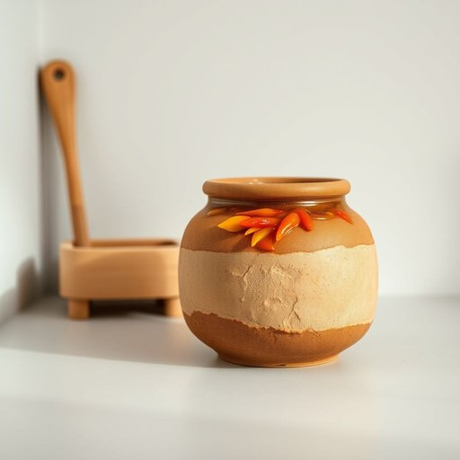

# crock

<h1 style="font-size: 2.5em; font-weight: 300; letter-spacing: 2px; margin: 0; color: #2c3e50;">
/krɑk/
</h1>

---

---

## 例句

Could you please pass me the crock that’s sitting next to the wooden spice rack on the kitchen counter, the one filled with homemade chutney that Mum prepared last weekend, because I’d like to add a generous spoonful to the stew before it simmers any longer?

*Could(/kʊd/) you(/ju/) please(/pliz/) pass(/pæs/) me(/mi/) the(/ðə/) crock(/krɑk/) that’s(/that’s*/) sitting(/ˈsɪtɪŋ/) next(/nɛkst/) to(/tɪ/) the(/ðə/) wooden(/ˈwʊdən/) spice(/spaɪs/) rack(/ræk/) on(/ɔn/) the(/ðə/) kitchen(/ˈkɪʧən/) counter,(/ˈkaʊntər,/) the(/ðə/) one(/wən/) filled(/fɪld/) with(/wɪθ/) homemade(/ˈhoʊˈmeɪd/) chutney(/ˈʧətni/) that(/ðət/) Mum(/məm/) prepared(/priˈpɛrd/) last(/læst/) weekend,(/ˈwiˌkɪnd,/) because(/bɪˈkəz/) I’d(/i’d*/) like(/laɪk/) to(/tɪ/) add(/æd/) a(/ə/) generous(/ˈʤɛnərəs/) spoonful(/ˈspunˌfʊl/) to(/tɪ/) the(/ðə/) stew(/stu/) before(/ˌbiˈfɔr/) it(/ɪt/) simmers(/ˈsɪmərz/) any(/ˈɛni/) longer?(/ˈlɔŋgər?/)*

**翻译：** 请把厨房桌面上靠近那个木制调味架旁边的罐子递给我，就是那个装满了妈妈上周末自制酸辣酱的罐子，因为我想在炖菜再煮一会儿之前舀上一大勺加入进去。

---

## 解释

英语单词crock作为名词在家居生活用品场景中通常指一种陶瓷罐陶瓷坛或陶罐常用于存放食品如泡菜盐渍食品酱料或者保存液体等这类容器通常较粗糙厚重质地坚硬能防止食物变质尤其在传统或乡村家庭厨房中较为常见学习者在使用crock时需注意其不可数和可数用法通常指具体容器时为可数名词如a crock of pickles装泡菜的陶罐而泛指这类陶制容器时则可以作为不可数名词crock常与potjar类似但更强调陶制且较大且密封性能好的罐子在表达技巧上搭配动词如store储存preserve保存较为常见此外短语crockery指陶瓷器皿是其同根词词源上crock来自古英语crocc意即陶罐或陶瓷器其发展与陶器制作历史密不可分反映出早期人类对储存和保存食物的需求crock在中文语境中通常准确译为陶罐陶坛或瓷罐侧重其材质和用途非专业陶瓷器的笼统称呼需要注意的是crock在英语中也有俚语用法表示废话或谎言带有贬义但在家居生活用品语境中此含义一般不会被混淆使用时应根据语境明确含义总结来说crock在家居用品中指实用的陶瓷储存罐强调其传统质朴和实用性是与中国传统陶坛相似的日常生活器具

---

<small style="color: #999; font-size: 0.9em;">2025-07-17 06:22:39</small>

