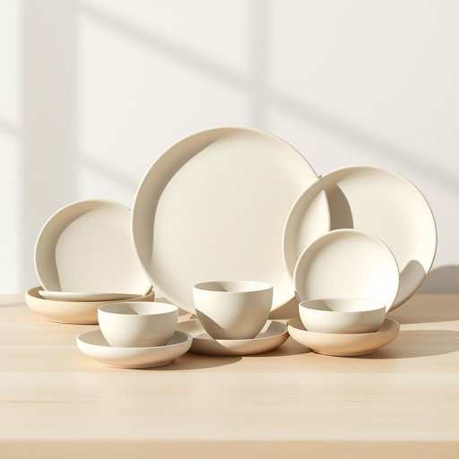

# crockery

<h1 style="font-size: 2.5em; font-weight: 300; letter-spacing: 2px; margin: 0; color: #2c3e50;">
/ˈkrɑkəri/
</h1>

---

---

## 例句

After the investor scrutinized the merger proposal’s intricate financial projections and potential market impacts, he decided to prioritize the long-term sustainability of the corporation over short-term profits when evaluating the stock’s value in his diverse portfolio.

*After(/ˈæftər/) the(/ðə/) investor(/ˌɪnˈvɛstər/) scrutinized(/ˈskrutəˌnaɪzd/) the(/ðə/) merger(/ˈmərʤər/) proposal’s(/proposal’s*/) intricate(/ˈɪntrəkət/) financial(/ˌfaɪˈnænʃəl/) projections(/prɑˈʤɛkʃənz/) and(/ənd/) potential(/pəˈtɛnʃəl/) market(/ˈmɑrkɪt/) impacts,(/ˌɪmˈpækts,/) he(/hi/) decided(/ˌdɪˈsaɪdɪd/) to(/tɪ/) prioritize(/praɪˈɔrəˌtaɪz/) the(/ðə/) long-term(/ˈlɔŋˈtərm/) sustainability(/səˌsteɪnəˈbɪlɪti/) of(/əv/) the(/ðə/) corporation(/ˌkɔrpərˈeɪʃən/) over(/ˈoʊvər/) short-term(/ˌʃɔrtˈtərm/) profits(/ˈprɑfɪts/) when(/wɪn/) evaluating(/ɪˈvæljuˌeɪtɪŋ/) the(/ðə/) stock’s(/stock’s*/) value(/ˈvælju/) in(/ɪn/) his(/hɪz/) diverse(/dɪˈvərs/) portfolio.(/pɔrtˈfoʊliˌoʊ./)*

**翻译：** 在投资者细致审查了合并提案中复杂的财务预测及潜在的市场影响后，他决定在评估其多元化投资组合中的该股票价值时，将公司的长期可持续发展置于短期利润之上。

---

## 解释

“crockery”作为名词在家居生活用品的语境中，主要指的是由陶瓷、瓷器或其他类似材料制成的餐具器皿，如盘子、碟子、碗、茶杯等，通常用于盛放和食用食物。具体使用场合多见于家庭厨房、餐厅或聚会场景中谈论餐具的集合时，例如“put the crockery in the cupboard”（把餐具放进橱柜）。英语学习者在使用该词时需注意，crockery一般作为不可数名词使用，不宜单独复数形式出现，且常与量词如“some”、“a set of”搭配，表示一套或一些餐具。此外，常用搭配包括“break the crockery”（打碎餐具）、“wash the crockery”（洗餐具）、“buy new crockery”（买新餐具）等。词源上，“crockery”来自中世纪英语“crock”一词，源自古英语“crocc”，意为小陶器，而后在19世纪逐渐特指家庭用的陶瓷餐具集合。中文语境中，crockery准确翻译为“陶瓷餐具”、“瓷器”或更广义的“餐具”，强调材质和用途。该词本身无褒贬含义，也不含特殊文化色彩，仅为中性词汇，用于描述日常生活中普遍存在的餐饮器皿，适合正式和非正式场合通用，使用时须注意避免混淆其他材质如玻璃器皿或金属餐具。

---

<small style="color: #999; font-size: 0.9em;">2025-07-17 06:22:39</small>

