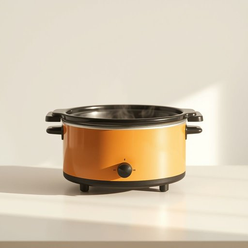

# crockpot

<h1 style="font-size: 2.5em; font-weight: 300; letter-spacing: 2px; margin: 0; color: #2c3e50;">
/crockpot*/
</h1>

---

---

## 例句

After reading countless rave reviews about how effortlessly the crockpot can transform simple ingredients into a hearty, slow-cooked stew, I finally decided to dust off the crockpot that had been gathering dust in the kitchen cupboard for years to prepare warm, home-cooked meals during these chilly winter evenings when I hardly have the energy to stand by the stove for hours.

*After(/ˈæftər/) reading(/ˈrɛdɪŋ/) countless(/ˈkaʊntləs/) rave(/reɪv/) reviews(/rəvˈjuz/) about(/əˈbaʊt/) how(/haʊ/) effortlessly(/ˈɛfərtləsli/) the(/ðə/) crockpot(/crockpot*/) can(/kən/) transform(/ˈtrænsfɔrm/) simple(/ˈsɪmpəl/) ingredients(/ˌɪnˈgridiənts/) into(/ˈɪntu/) a(/ə/) hearty,(/ˈhɑrti,/) slow-cooked(/slow-cooked*/) stew,(/stu,/) I(/aɪ/) finally(/ˈfaɪnəli/) decided(/ˌdɪˈsaɪdɪd/) to(/tɪ/) dust(/dəst/) off(/ɔf/) the(/ðə/) crockpot(/crockpot*/) that(/ðət/) had(/hæd/) been(/bɪn/) gathering(/ˈgæðərɪŋ/) dust(/dəst/) in(/ɪn/) the(/ðə/) kitchen(/ˈkɪʧən/) cupboard(/ˈkəbərd/) for(/fər/) years(/jɪrz/) to(/tɪ/) prepare(/priˈpɛr/) warm,(/wɔrm,/) home-cooked(/home-cooked*/) meals(/milz/) during(/ˈdʊrɪŋ/) these(/ðiz/) chilly(/ˈʧɪli/) winter(/ˈwɪntər/) evenings(/ˈivnɪŋz/) when(/wɪn/) I(/aɪ/) hardly(/ˈhɑrdli/) have(/hæv/) the(/ðə/) energy(/ˈɛnərʤi/) to(/tɪ/) stand(/stænd/) by(/baɪ/) the(/ðə/) stove(/stoʊv/) for(/fər/) hours.(/aʊərz./)*

**翻译：** 在读了无数关于慢炖锅如何轻松将简单食材变成丰盛慢炖炖菜的好评后，我终于决定拿出那台许多年一直积尘于厨房橱柜的慢炖锅，准备在这寒冷的冬夜里，为自己做些温暖的家常菜——毕竟，我几乎没有精力站在炉边几个小时了。

---

## 解释

“crockpot”作为英语名词，在家居生活用品场景中指的是一种电炖锅或慢炖锅，通常用于长时间低温烹调食物，特别适合烹调炖菜、汤类和肉类，使食材充分入味且保持嫩滑，具体使用场合多见于家庭厨房，尤其是需要预先准备然后长时间慢煮的菜肴场景，英语学习者需注意该词一般作可数名词使用，常见搭配有“use a crockpot”（使用电炖锅）、“set the crockpot”（设置电炖锅）、“a crockpot recipe”（电炖锅食谱）等，语法上与普通名词相同，可用于单数和复数形式（crockpots），表达中常结合动作动词如“cook with”、“leave in”等，突出其慢煮功能，词源方面，“crock”意指陶罐，最初指陶制容器，“pot”意为锅，合成词“crockpot”指陶制慢炖锅的烹调用具，源自20世纪中期美国家庭烹饪设备的普及，中文语境中，“crockpot”准确翻译为“电炖锅”或“慢炖锅”，强调其通过电加热设备慢火烹调的特色，区别于传统砂锅或普通炖锅，体现现代家居厨房便捷、省时的烹饪工具，值得注意的是，“crockpot”无特别褒贬含义，文化上多与家庭温馨、简便料理相关联，象征着节省时间且易于准备丰盛饭菜的生活方式。

---

<small style="color: #999; font-size: 0.9em;">2025-07-17 06:22:39</small>

