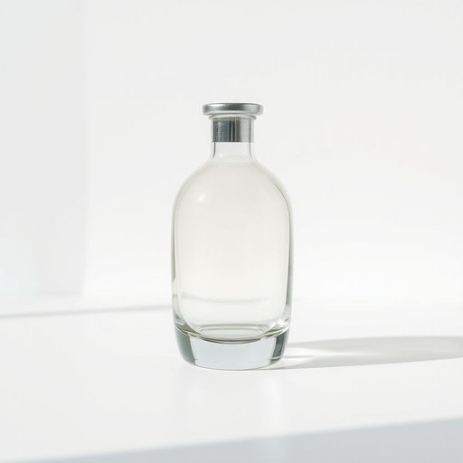

# cruet

<h1 style="font-size: 2.5em; font-weight: 300; letter-spacing: 2px; margin: 0; color: #2c3e50;">
/cruet*/
</h1>

---

---

## 例句

Could you please pass me the cruet that’s sitting next to the napkins on the dining table, the one with the ornate silver lid and the delicate glass body, so I can add a bit of olive oil and balsamic vinegar to my salad before everyone starts eating?

*Could(/kʊd/) you(/ju/) please(/pliz/) pass(/pæs/) me(/mi/) the(/ðə/) cruet(/cruet*/) that’s(/that’s*/) sitting(/ˈsɪtɪŋ/) next(/nɛkst/) to(/tɪ/) the(/ðə/) napkins(/ˈnæpkɪnz/) on(/ɔn/) the(/ðə/) dining(/ˈdaɪnɪŋ/) table,(/ˈteɪbəl,/) the(/ðə/) one(/wən/) with(/wɪθ/) the(/ðə/) ornate(/ɔrˈneɪt/) silver(/ˈsɪlvər/) lid(/lɪd/) and(/ənd/) the(/ðə/) delicate(/ˈdɛləkət/) glass(/glæs/) body,(/ˈbɑdi,/) so(/soʊ/) I(/aɪ/) can(/kən/) add(/æd/) a(/ə/) bit(/bɪt/) of(/əv/) olive(/ˈɑlɪv/) oil(/ɔɪl/) and(/ənd/) balsamic(/balsamic*/) vinegar(/ˈvɪnəgər/) to(/tɪ/) my(/maɪ/) salad(/ˈsæləd/) before(/ˌbiˈfɔr/) everyone(/ˈɛvriˌwən/) starts(/stɑrts/) eating?(/ˈitɪŋ?/)*

**翻译：** 你能把餐桌上餐巾旁边的那只调味瓶递给我吗？就是那个带有精致银盖和透亮玻璃瓶身的，我想在大家开始用餐前给我的沙拉加一点橄榄油和意大利香醋。

---

## 解释

英语单词“cruet”在家居生活用品的语境中作为名词，指的是一种用来盛装调味品的小容器，通常是一对或一套，包括盛放盐、胡椒粉、油、醋等液体或粉状调味料的小瓶或罐子，常见于餐桌上用来方便取用调味料。具体使用场合多出现在餐饮场合或家庭用餐时，如“pass the cruet”意为“递一下调味瓶”。英语学习者在使用“cruet”时需注意其单数形式表示单个调味瓶，而复数形式“cruets”一般指成套的调味瓶组合，且通常与“set”“stand”等词搭配，如“a cruet set”或“a cruet stand”。此外，这个词多用于书面或较正式的语境，口语中较少使用，常被更通用的“salt shaker”“pepper pot”取代。该词源自中世纪法语“cruette”，意为小瓶，进一步源自拉丁语“cruor”，意指液体或血液，反映了其作为装液体容器的功能。中文通常将“cruet”准确翻译为“调味瓶”或“调料瓶”，根据具体内容也可理解为“盐瓶”“胡椒瓶”“油醋瓶”等。需要注意的是，该词没有明显的褒贬意义，也无特殊的文化内涵，属于中性词，主要强调其实用功能和餐桌上的应用。

---

<small style="color: #999; font-size: 0.9em;">2025-07-17 06:22:39</small>

