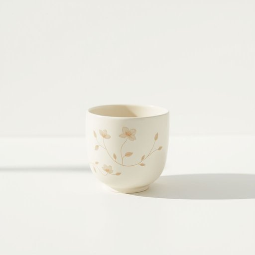

# cup

<h1 style="font-size: 2.5em; font-weight: 300; letter-spacing: 2px; margin: 0; color: #2c3e50;">
/kəp/
</h1>

---

---

## 例句

Could you please put the cup I left on the counter, the one with the floral pattern that Mum bought last summer, into the dishwasher before you start cooking dinner?

*Could(/kʊd/) you(/ju/) please(/pliz/) put(/pʊt/) the(/ðə/) cup(/kəp/) I(/aɪ/) left(/lɛft/) on(/ɔn/) the(/ðə/) counter,(/ˈkaʊntər,/) the(/ðə/) one(/wən/) with(/wɪθ/) the(/ðə/) floral(/ˈflɔrəl/) pattern(/ˈpætərn/) that(/ðət/) Mum(/məm/) bought(/bɔt/) last(/læst/) summer,(/ˈsəmər,/) into(/ˈɪntu/) the(/ðə/) dishwasher(/ˈdɪʃˌwɑʃər/) before(/ˌbiˈfɔr/) you(/ju/) start(/stɑrt/) cooking(/ˈkʊkɪŋ/) dinner?(/ˈdɪnər?/)*

**翻译：** 在你开始做晚餐之前，能否请你把我留在柜台上的那个杯子——就是带有花卉图案、妈妈去年夏天买的那只——放进洗碗机里？

---

## 解释

英语单词“cup”作为名词，在家居生活用品场景中通常指一种用于盛放饮料，尤其是热饮如茶、咖啡的容器，多为带有把手的圆形小容器，常见材质有陶瓷、玻璃或塑料。具体使用场合包括早餐时喝咖啡或茶、客厅招待客人时端茶、厨房储放杯具等。英语学习者需要注意“cup”的可数性质，通常在表达数量时使用复数形式“cups”，且常与量词及形容词搭配，如“a cup of tea”（一杯茶）、“a coffee cup”（咖啡杯）等。此外，“cup”也常出现在固定短语中，如“to raise a cup”意为“举杯祝酒”，学习时要注意其不同搭配的意义变化。词源上，“cup”源自古英语“cuppe”，其根源可追溯到拉丁语“cupa”，意指小桶或杯子，反映了人类对盛装容器的基础需求。中文语境中，“cup”通常准确翻译为“杯子”，偏重于带把手的小型饮具，与“glass”（玻璃杯）、“mug”（马克杯）等有所区分，体现其特定形态与用途。“cup”在家居生活中属于中性词，无褒贬含义，但在文化层面上，举杯行为常带有礼仪和社交象征，学习者应注意语境以避免误用。

---

<small style="color: #999; font-size: 0.9em;">2025-07-17 06:22:39</small>

