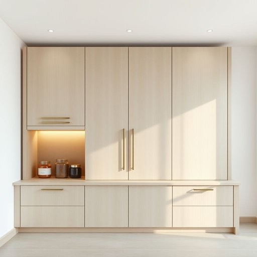

# cupboard

<h1 style="font-size: 2.5em; font-weight: 300; letter-spacing: 2px; margin: 0; color: #2c3e50;">
/ˈkəbərd/
</h1>

---

---

## 例句

Could you please check the cupboard in the kitchen, where we usually keep the tea, coffee, and all those little jars of spices, to see if there’s any sugar left before I start making the afternoon tea?

*Could(/kʊd/) you(/ju/) please(/pliz/) check(/ʧɛk/) the(/ðə/) cupboard(/ˈkəbərd/) in(/ɪn/) the(/ðə/) kitchen,(/ˈkɪʧən,/) where(/wɛr/) we(/wi/) usually(/ˈjuʒəwəli/) keep(/kip/) the(/ðə/) tea,(/ti,/) coffee,(/ˈkɔfi,/) and(/ənd/) all(/ɔl/) those(/ðoʊz/) little(/ˈlɪtəl/) jars(/ʤɑrz/) of(/əv/) spices,(/ˈspaɪsɪz,/) to(/tɪ/) see(/si/) if(/ɪf/) there’s(/there’s*/) any(/ˈɛni/) sugar(/ˈʃʊgər/) left(/lɛft/) before(/ˌbiˈfɔr/) I(/aɪ/) start(/stɑrt/) making(/ˈmeɪkɪŋ/) the(/ðə/) afternoon(/ˌæftərˈnun/) tea?(/ti?/)*

**翻译：** 请你帮忙查看一下厨房的橱柜吗？我们平时把茶叶、咖啡和各种香料小罐子都放在那里，看看里面还有没有糖，好让我开始准备下午茶。

---

## 解释

cupboard作为名词，指的是家居生活中用于存放物品的柜子，通常用于厨房中存放餐具、食品或调味品，但也可指其他房间里存放衣物或杂物的小储藏柜。使用场合多见于家庭环境、家具描述或室内布置谈论中，语境较为生活化且具体。英语学习者使用cupboard时应注意其作可数名词，单复数形式为cupboard/cupboards，常见搭配有kitchen cupboard（厨房橱柜）、cupboard door（柜门）、open/close the cupboard（打开/关闭柜子），此外，cupboard一般指带门的柜子，不同于open shelf（开放式架子），这一点在表达细节时较为重要。词源上，cupboard源自中古英语，最初意为存放杯子的橱柜（cup + board），反映了其最初用作存放饮具的功能，随着时间发展范围扩大至一般储物家具。中文语境中，cupboard通常准确翻译为“碗柜”、“橱柜”或“储物柜”，强调其封闭可存放的属性，需避免误译成开放架子。该词无特殊褒贬或文化内涵，属于中性词汇，使用时主要根据具体物品种类和方位进行恰当描述，不带特别感情色彩。

---

<small style="color: #999; font-size: 0.9em;">2025-07-17 06:22:39</small>

