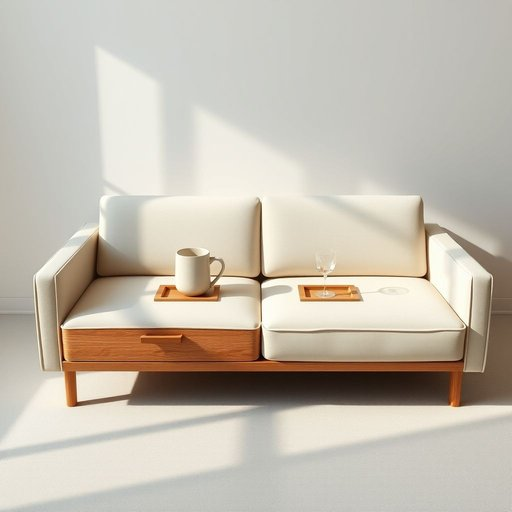

# cupholder

<h1 style="font-size: 2.5em; font-weight: 300; letter-spacing: 2px; margin: 0; color: #2c3e50;">
/cupholder*/
</h1>

---

---

## 例句

While the sofa's elegance was undeniable, it was the hidden built-in cupholder that truly enhanced the experience by securely accommodating both large mugs and small glasses during movie nights.

*While(/waɪl/) the(/ðə/) sofa's(/sofa's*/) elegance(/ˈɛləgəns/) was(/wɑz/) undeniable,(/ˌəndɪˈnaɪəbəl,/) it(/ɪt/) was(/wɑz/) the(/ðə/) hidden(/ˈhɪdən/) built-in(/ˈbɪlˌtɪn/) cupholder(/cupholder*/) that(/ðət/) truly(/ˈtruli/) enhanced(/ɛnˈhænst/) the(/ðə/) experience(/ɪkˈspɪriəns/) by(/baɪ/) securely(/sɪˈkjʊrli/) accommodating(/əˈkɑməˌdeɪtɪŋ/) both(/boʊθ/) large(/lɑrʤ/) mugs(/məgz/) and(/ənd/) small(/smɔl/) glasses(/ˈglæsɪz/) during(/ˈdʊrɪŋ/) movie(/ˈmuvi/) nights.(/naɪts./)*

**翻译：** 沙发的优雅毋庸置疑，但真正提升观影体验的，是那隐藏式内置杯架，能够稳妥地容纳大杯马克杯和小巧玻璃杯。

---

## 解释

英语单词"cupholder"在家居生活用品语境中作为名词，指的是用于固定和放置杯子或饮料容器的小型支架或托盘，常见于汽车座位旁、桌子边缘、沙发扶手甚至家用家具中，方便人们稳固放置水杯、咖啡杯等，避免洒出液体。英语学习者使用该词时应注意，"cupholder"为可数名词，其复数形式为"cupholders"，常见搭配包括"car cupholder"（车内杯架）、"built-in cupholder"（内置杯架）等，表达时通常用作名词直接指代具体物品，且不需复合结构修饰；此外，该词多用于日常生活和口语环境中，语法上无特殊复杂性。词源方面，"cupholder"由"cup"（杯子）和"holder"（持有者、支架）复合而成，形象地描述了其功能，即用来"持有杯子"的装置。中文语境中，"cupholder"准确译为“杯架”或“杯托”，强调其固定杯子以防止倾倒的实用功能，没有特殊褒贬含义或文化负载，属于家居生活中常见的便利性小物件，使用时主要体现舒适与实用，是现代家具和车辆中日益普及的设计元素。

---

<small style="color: #999; font-size: 0.9em;">2025-07-17 06:22:39</small>

