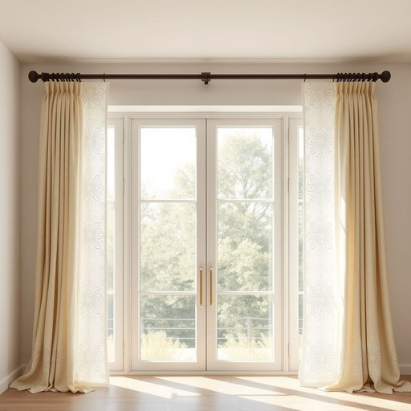

# curtain-rod

<h1 style="font-size: 2.5em; font-weight: 300; letter-spacing: 2px; margin: 0; color: #2c3e50;">
/curtain-rod*/
</h1>

---

---

## 例句

Before installing the elaborate drapery, which features intricate embroidery and delicate lace, we must first ensure that the curtain-rod, crafted from reinforced steel and designed to span the unusually wide bay window, is securely mounted to withstand not only the fabric's substantial weight but also the occasional gusts of wind that seep through the gaps in the old casement.

*Before(/ˌbiˈfɔr/) installing(/ˌɪnˈstɔlɪŋ/) the(/ðə/) elaborate(/ɪˈlæbərˌeɪt/) drapery,(/ˈdreɪpəri,/) which(/wɪʧ/) features(/ˈfiʧərz/) intricate(/ˈɪntrəkət/) embroidery(/ɛmˈbrɔɪdəri/) and(/ənd/) delicate(/ˈdɛləkət/) lace,(/leɪs,/) we(/wi/) must(/məst/) first(/fərst/) ensure(/ɪnˈʃʊr/) that(/ðət/) the(/ðə/) curtain-rod,(/curtain-rod*,/) crafted(/ˈkræftɪd/) from(/frəm/) reinforced(/ˌriɪnˈfɔrst/) steel(/stil/) and(/ənd/) designed(/dɪˈzaɪnd/) to(/tɪ/) span(/spæn/) the(/ðə/) unusually(/ənˈjuˌʒuəli/) wide(/waɪd/) bay(/beɪ/) window,(/ˈwɪndoʊ,/) is(/ɪz/) securely(/sɪˈkjʊrli/) mounted(/ˈmaʊnɪd/) to(/tɪ/) withstand(/wɪθˈstænd/) not(/nɑt/) only(/ˈoʊnli/) the(/ðə/) fabric's(/fabric's*/) substantial(/səbˈstænʃəl/) weight(/weɪt/) but(/bət/) also(/ˈɔlsoʊ/) the(/ðə/) occasional(/ɔˈkeɪʒənəl/) gusts(/gəsts/) of(/əv/) wind(/wɪnd/) that(/ðət/) seep(/sip/) through(/θru/) the(/ðə/) gaps(/gæps/) in(/ɪn/) the(/ðə/) old(/oʊld/) casement.(/casement*./)*

**翻译：** 在安装这幅绣有精美刺绣且饰有细腻蕾丝的华丽窗帘之前，我们必须先确保由加固钢材制成、为跨越异常宽阔的飘窗而设计的窗帘杆牢固安装，以承受不仅是窗帘厚重的重量，还有穿透旧式推拉窗缝隙时偶尔掠过的阵阵风力。

---

## 解释

英语单词"curtain-rod"作为名词，指的是一种用于悬挂窗帘的杆子，通常安装在窗户上方或墙面，起到支撑和固定窗帘的作用，常见于家庭、办公室等室内空间。当英语学习者使用该词时，应注意其复合名词结构，“curtain”意为窗帘，“rod”意为杆，二者组合形成具体名词，通常用连字符连接以表达整体含义，且多用于单数或复数形式“curtain rods”。常见搭配包括“install a curtain rod”（安装窗帘杆）、“extendable curtain rod”（可伸缩窗帘杆）、“metal/plastic curtain rod”（金属/塑料窗帘杆）等，表达时要注意其作为具体物件的可数名词属性。词源方面，"curtain"源自中古英语，意为帘幕，"rod"来自古英语，意为细长的棍棒，两者结合直观地描述了窗帘悬挂的横杆工具。中文语境中，“curtain-rod”通常准确译为“窗帘杆”或“窗帘杆子”，是家居生活用品中的常见装置，词义中性，无特殊褒贬或文化色彩，使用时重点在于其功能性和实用性。

---

<small style="color: #999; font-size: 0.9em;">2025-07-17 06:22:39</small>

