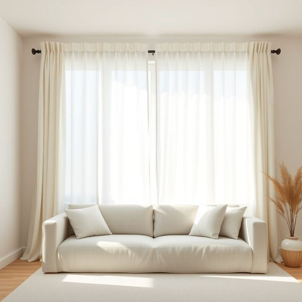

# curtain

<h1 style="font-size: 2.5em; font-weight: 300; letter-spacing: 2px; margin: 0; color: #2c3e50;">
/ˈkərtən/
</h1>

---

---

## 例句

Could you please draw the curtain across the window before the sun gets too harsh, as it not only helps to keep the living room cooler but also protects the delicate fabric of the sofa from fading over time?

*Could(/kʊd/) you(/ju/) please(/pliz/) draw(/drɔ/) the(/ðə/) curtain(/ˈkərtən/) across(/əˈkrɔs/) the(/ðə/) window(/ˈwɪndoʊ/) before(/ˌbiˈfɔr/) the(/ðə/) sun(/sən/) gets(/gɪts/) too(/tu/) harsh,(/hɑrʃ,/) as(/ɛz/) it(/ɪt/) not(/nɑt/) only(/ˈoʊnli/) helps(/hɛlps/) to(/tɪ/) keep(/kip/) the(/ðə/) living(/ˈlɪvɪŋ/) room(/rum/) cooler(/ˈkulər/) but(/bət/) also(/ˈɔlsoʊ/) protects(/prəˈtɛkts/) the(/ðə/) delicate(/ˈdɛləkət/) fabric(/ˈfæbrɪk/) of(/əv/) the(/ðə/) sofa(/ˈsoʊfə/) from(/frəm/) fading(/ˈfeɪdɪŋ/) over(/ˈoʊvər/) time?(/taɪm?/)*

**翻译：** 在阳光变得过于强烈之前，能否请你把窗帘拉上？这样不仅有助于保持客厅的凉爽，还能保护沙发那娇嫩的布料，避免其随着时间褪色。

---

## 解释

英语单词“curtain”作为家居生活用品中的名词，主要指用于窗户或门口的布帘，用来遮挡光线、保护隐私或美化室内环境。具体使用场合多见于描述家庭、办公室、影院等场所的窗帘或舞台帷幕，例如“draw the curtains”（拉上窗帘）、“the curtains are made of silk”（窗帘是丝绸制的）。英语学习者在使用该词时需注意，“curtain”是可数名词，单复数形式分别为“curtain”和“curtains”，且通常指一对窗帘时使用复数形式；此外，常见搭配有“curtain rod”（窗帘杆）、“curtain fabric”（窗帘布）、“curtain track”（窗帘轨道）等，表达时多与装饰、功能相关的词组合使用。词源上，“curtain”源自拉丁语“cortina”，原意为围墙或帷幕，经过法语“courtine”演变而来，意指用布制成的遮蔽物。中文环境下，“curtain”准确翻译为“窗帘”或“帘子”，强调其遮光与装饰作用，无特殊褒贬含义，但在不同文化背景中窗帘的材质和款式可能带有美学或隐私的象征意义。整体而言，该词在日常生活中应用广泛，易于理解，学习时重点在于区分其单复数形式及与其相关的固定搭配。

---

<small style="color: #999; font-size: 0.9em;">2025-07-17 06:22:39</small>

