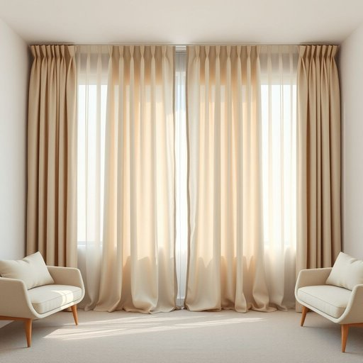

# curtains

<h1 style="font-size: 2.5em; font-weight: 300; letter-spacing: 2px; margin: 0; color: #2c3e50;">
/ˈkərtənz/
</h1>

---

---

## 例句

Considering the intricate interplay of light and shadow, I’m deliberating on replacing the old curtains in the living room with those that not only harmonize with the updated color scheme but also possess blackout properties to maintain darkness during the day, particularly because the sunlight gradually fades the furniture over time.

*Considering(/kənˈsɪdərɪŋ/) the(/ðə/) intricate(/ˈɪntrəkət/) interplay(/ˈɪntərˌpleɪ/) of(/əv/) light(/laɪt/) and(/ənd/) shadow,(/ˈʃæˌdoʊ,/) I’m(/i’m*/) deliberating(/dɪˈlɪbərˌeɪtɪŋ/) on(/ɔn/) replacing(/rɪˈpleɪsɪŋ/) the(/ðə/) old(/oʊld/) curtains(/ˈkərtənz/) in(/ɪn/) the(/ðə/) living(/ˈlɪvɪŋ/) room(/rum/) with(/wɪθ/) those(/ðoʊz/) that(/ðət/) not(/nɑt/) only(/ˈoʊnli/) harmonize(/ˈhɑrməˌnaɪz/) with(/wɪθ/) the(/ðə/) updated(/ˈəpˌdeɪtɪd/) color(/ˈkələr/) scheme(/skim/) but(/bət/) also(/ˈɔlsoʊ/) possess(/pəˈzɛs/) blackout(/ˈblæˌkaʊt/) properties(/ˈprɑpərtiz/) to(/tɪ/) maintain(/meɪnˈteɪn/) darkness(/ˈdɑrknəs/) during(/ˈdʊrɪŋ/) the(/ðə/) day,(/deɪ,/) particularly(/ˌpɑrˈtɪkjələrli/) because(/bɪˈkəz/) the(/ðə/) sunlight(/ˈsənˌlaɪt/) gradually(/ˈgræʤuəli/) fades(/feɪdz/) the(/ðə/) furniture(/ˈfərnɪʧər/) over(/ˈoʊvər/) time.(/taɪm./)*

**翻译：** 考虑到光影的复杂交织，我正在考虑将客厅里旧的窗帘更换为不仅与更新后的色彩方案相协调，还具备遮光功能的窗帘，以确保白天室内保持昏暗，尤其是因为阳光会随着时间的推移逐渐使家具褪色。

---

## 解释

“curtains”作为名词在家居生活用品的语境中，指的是悬挂在窗户上的布制遮挡物，用于遮光、防止外界视线、装饰房间等。具体使用场合多见于室内装修描述、家居购物、布艺设计等情境，如“draw the curtains”（拉开窗帘）、“the curtains are made of silk”（窗帘是丝绸制的）。英语学习者使用时需注意，“curtains”通常用作复数名词，不用单数形式“curtain”指窗帘整体，但可指单片或单侧窗帘；动词形式如“to curtain”较少用。常见搭配包括“curtain rod”（窗帘杆）、“curtain fabric”（窗帘布料）、“curtain call”（此为戏剧用语，指演员谢幕，与家居无关）。词源上，“curtain”起源于中古法语“cortine”，源自拉丁语“cortina”，意指帷幕、帐篷，体现其遮挡功能。中文通常译为“窗帘”，精准反映其功能和形态，在日常交流和家居装修中广泛使用，无褒贬含义，属中性词汇。文化上，窗帘在不同国家可能有不同的材质和风格，但其基本用途一致。

---

<small style="color: #999; font-size: 0.9em;">2025-07-17 06:22:39</small>

