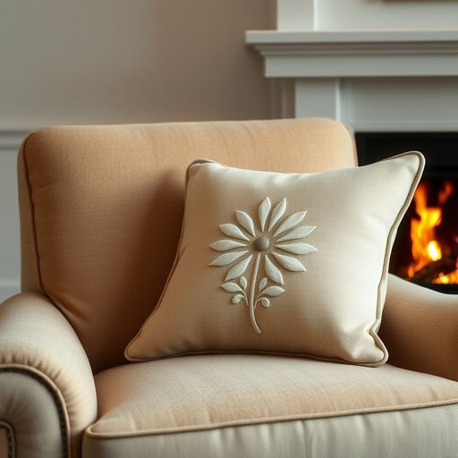

# cushion

<h1 style="font-size: 2.5em; font-weight: 300; letter-spacing: 2px; margin: 0; color: #2c3e50;">
/ˈkʊʃən/
</h1>

---

---

## 例句

Could you please fluff up the cushion on the armchair by the fireplace, the one with the faded floral pattern that Mum bought last summer, because it’s lost all its shape and no longer offers any support when you’re reading in the evening?

*Could(/kʊd/) you(/ju/) please(/pliz/) fluff(/fləf/) up(/əp/) the(/ðə/) cushion(/ˈkʊʃən/) on(/ɔn/) the(/ðə/) armchair(/ˈɑrmˌʧɛr/) by(/baɪ/) the(/ðə/) fireplace,(/ˈfaɪərˌpleɪs,/) the(/ðə/) one(/wən/) with(/wɪθ/) the(/ðə/) faded(/ˈfeɪdɪd/) floral(/ˈflɔrəl/) pattern(/ˈpætərn/) that(/ðət/) Mum(/məm/) bought(/bɔt/) last(/læst/) summer,(/ˈsəmər,/) because(/bɪˈkəz/) it’s(/it’s*/) lost(/lɔst/) all(/ɔl/) its(/ɪts/) shape(/ʃeɪp/) and(/ənd/) no(/noʊ/) longer(/ˈlɔŋgər/) offers(/ˈɔfərz/) any(/ˈɛni/) support(/səˈpɔrt/) when(/wɪn/) you’re(/you’re*/) reading(/ˈrɛdɪŋ/) in(/ɪn/) the(/ðə/) evening?(/ˈivnɪŋ?/)*

**翻译：** 请你帮忙把壁炉旁扶手椅上那个去年夏天妈妈买的、带有褪色花卉图案的靠垫拍松一下吧，因为它已经完全走形，坐着读书的时候再也没有支撑感了。

---

## 解释

英语单词“cushion”作为名词在家居生活用品语境中，通常指的是用柔软材料填充并覆盖有布套的小垫子，常见于沙发、椅子或床上，用以提供坐卧的舒适度和支撑感。具体使用场合多为谈论家具布置、家居装饰或舒适度提升时，例如“put cushions on the sofa”（在沙发上放垫子），“decorative cushions”（装饰用垫子）等。学习者在使用“cushion”时需注意其可数名词性质，复数形式为“cushions”，且常用搭配包括“throw cushion”（靠垫）、“seat cushion”（坐垫）、“back cushion”（靠背垫）等表达，此外，与“cushion”相关的动词形式也可表示“缓冲、减轻冲击”，但这里侧重名词用法。在语法上，“cushion”通常作可数名词出现，前面可加不定冠词“a”或数字修饰，且多与介词短语连用描述其位置或用途。词源方面，“cushion”源自中古英语“cuschin”，进一步源于古法语“cuisin”，起源于拉丁语“culcita”，意为软垫或床垫，反映了其柔软衬垫的本义。中文语境中，“cushion”一般准确翻译为“靠垫”或“垫子”，根据具体用途不同可译为“坐垫”、“抱枕”等，强调其软且用于增添舒适度和装饰性的功能。该词无明显褒贬色彩，属于中性词汇，但在文化内涵上，家居中的“cushion”常被视为生活品质和舒适度的体现，亦有一定装饰美学价值。综上，“cushion”在家居环境中作为名词时，强调其柔软垫子的特性与实用及美观功能，是日常生活中常见且重要的家居用品用语。

---

<small style="color: #999; font-size: 0.9em;">2025-07-17 06:22:39</small>

