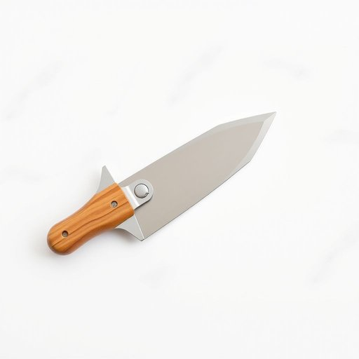

# cutter

<h1 style="font-size: 2.5em; font-weight: 300; letter-spacing: 2px; margin: 0; color: #2c3e50;">
/ˈkətər/
</h1>

---

---

## 例句

Despite the apparent simplicity of the cutter, its exceptional sharpness and ergonomic design make it indispensable in the kitchen, especially when opening stubborn packets or preparing intricate garnishes.

*Despite(/dɪˈspaɪt/) the(/ðə/) apparent(/əˈpɛrənt/) simplicity(/sɪmˈplɪsɪti/) of(/əv/) the(/ðə/) cutter,(/ˈkətər,/) its(/ɪts/) exceptional(/ɪkˈsɛpʃənəl/) sharpness(/ˈʃɑrpnəs/) and(/ənd/) ergonomic(/ˌərgəˈnɑmɪk/) design(/dɪˈzaɪn/) make(/meɪk/) it(/ɪt/) indispensable(/ˌɪndɪˈspɛnsəbəl/) in(/ɪn/) the(/ðə/) kitchen,(/ˈkɪʧən,/) especially(/əˈspɛʃəli/) when(/wɪn/) opening(/ˈoʊpənɪŋ/) stubborn(/ˈstəbərn/) packets(/ˈpækɪts/) or(/ər/) preparing(/pərˈpɛrɪŋ/) intricate(/ˈɪntrəkət/) garnishes.(/ˈgɑrnɪʃəz./)*

**翻译：** 尽管这把切割器看似简洁，但其非凡的锋利度和符合人体工学的设计，使其在厨房中不可或缺，尤为适合打开顽固的包装袋或制作精致的装饰。

---

## 解释

英语单词“cutter”在家居生活用品语境中作为名词，通常指用于切割的工具，如披萨切割器、纸张切割器、蔬菜切割器等，具体使用场合多为厨房、办公或手工制作环境中，用以表示形状多为带有刀片的器具。英语学习者使用“cutter”时应注意其单数复数变化为“cutters”，且常与具体类型的物品名称搭配，如“pizza cutter”、“cookie cutter”等，这种复合结构有助于准确表达切割的对象或用途。此外，表达时也要区分“cutter”作为工具与动词“cut”的不同词类，“cutter”本身作为名词侧重工具、职位或行为者的含义。词源方面，“cutter”源自中古英语“cutten”意为“切割”，加上表示“执行者或工具”的后缀“-er”，其本质含义即为“切割物”或“切割者”。在中文语境中，相对应的翻译有“切割器”、“切刀”或直接根据具体物品译为“切披萨刀”、“切纸刀”等，强调工具属性和切割功能，无明显褒贬意义，也无特殊文化色彩，属于中性词汇，用于家居用品时表达明确，便于实用交流。

---

<small style="color: #999; font-size: 0.9em;">2025-07-17 06:22:39</small>

