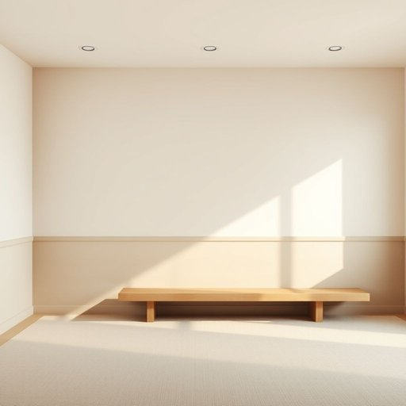

# dado

<h1 style="font-size: 2.5em; font-weight: 300; letter-spacing: 2px; margin: 0; color: #2c3e50;">
/ˈdeɪˌdoʊ/
</h1>

---

---

## 例句

Before we decide on the colour scheme for the living room, we should carefully inspect the dado, which runs along the lower half of the walls, because if it’s damaged or peeling, it might need repairing or repainting to ensure the whole room looks cohesive and well-maintained.

*Before(/ˌbiˈfɔr/) we(/wi/) decide(/ˌdɪˈsaɪd/) on(/ɔn/) the(/ðə/) colour(/ˈkələr/) scheme(/skim/) for(/fər/) the(/ðə/) living(/ˈlɪvɪŋ/) room,(/rum,/) we(/wi/) should(/ʃʊd/) carefully(/ˈkɛrfəli/) inspect(/ˌɪnˈspɛkt/) the(/ðə/) dado,(/ˈdeɪˌdoʊ,/) which(/wɪʧ/) runs(/rənz/) along(/əˈlɔŋ/) the(/ðə/) lower(/loʊər/) half(/hæf/) of(/əv/) the(/ðə/) walls,(/wɔlz,/) because(/bɪˈkəz/) if(/ɪf/) it’s(/it’s*/) damaged(/ˈdæmɪʤd/) or(/ər/) peeling,(/ˈpilɪŋ,/) it(/ɪt/) might(/maɪt/) need(/nid/) repairing(/rɪˈpɛrɪŋ/) or(/ər/) repainting(/riˈpeɪntɪŋ/) to(/tɪ/) ensure(/ɪnˈʃʊr/) the(/ðə/) whole(/hoʊl/) room(/rum/) looks(/lʊks/) cohesive(/koʊˈhisɪv/) and(/ənd/) well-maintained.(/well-maintained*./)*

**翻译：** 请按以下格式要求格式化结果，只返回格式化后的内容，不包含任何解释、思考过程或额外标记。请执行以下清理操作：1. 移除所有<think>...</think>标签及其内容 2. 移除所有[Ignore this...]标记 3. 如果存在JSON格式要求，确保输出符合要求 4. 移除\boxed{...}的标记，保留内容 5. 清理多余空白和换行 6. 按照格式要求排版和格式化 7. 不要添加任何解释或元信息 8. 对于输入的重要信息，输出为一整个段落，不要输出markdown内容，也不要输出bullet points，也不要增加信息或删除信息。格式要求：输出为普通文本，仅包含翻译结果，不包含任何多余内容或标签。

---

## 解释

英语单词“dado”在家居生活用品领域作为名词，主要指墙面下部的一段区域，通常被装饰为与上方墙面不同的材质或颜色，例如墙裙、护墙板等，这种设计既有美观作用，也能保护墙壁避免家具碰撞损坏。具体使用场合多见于室内装修、家具制造和建筑装饰语境中，如描述房间内部墙壁的布局时会提到“a dado rail”（护墙板）或“dado height”（墙裙高度）。学习者在使用“dado”时需注意其专用名词性质，多与“rail”（护墙板）、“panel”（面板）、“height”（高度）等词搭配，构成常用表达，如“install a dado rail”或“the dado is painted a different color”，语法上一般作为可数名词出现。该词源自意大利语“dado”，原意为“骰子”或骰子状物，后引申为一种立体的切口或框架形装饰，建筑中用来指代墙面的下部水平装饰带。中文语境中，“dado”准确翻译为“墙裙”或“护墙板”，是室内设计中非常具体且专业的术语，通常指墙体下方的一段装饰面板或墙裙线，高度适中，既起防护作用也兼顾装饰。这个词在现代英语建筑和装修领域属于中性词，无明显褒贬色彩，但因其专业性，非专业人士日常会话中较少使用，应结合具体装修描述场合采用，以避免混淆。

---

<small style="color: #999; font-size: 0.9em;">2025-07-17 06:22:39</small>

