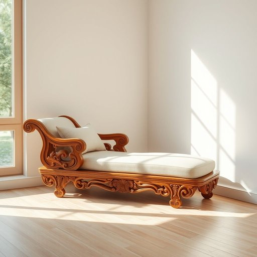

# daybed

<h1 style="font-size: 2.5em; font-weight: 300; letter-spacing: 2px; margin: 0; color: #2c3e50;">
/daybed*/
</h1>

---

---

## 例句

In the cozy nook by the window, where the morning light dances gently on the hardwood floor, the intricately carved daybed, which had been passed down through generations, not only provides a luxurious spot for reading but also serves as a splendid centerpiece that elevates the entire room’s ambiance, blending antique charm with modern comfort seamlessly.

*In(/ɪn/) the(/ðə/) cozy(/ˈkoʊzi/) nook(/nʊk/) by(/baɪ/) the(/ðə/) window,(/ˈwɪndoʊ,/) where(/wɛr/) the(/ðə/) morning(/ˈmɔrnɪŋ/) light(/laɪt/) dances(/ˈdænsɪz/) gently(/ˈʤɛntli/) on(/ɔn/) the(/ðə/) hardwood(/ˈhɑrdˌwʊd/) floor,(/flɔr,/) the(/ðə/) intricately(/ˈɪntrəkətli/) carved(/kɑrvd/) daybed,(/daybed*,/) which(/wɪʧ/) had(/hæd/) been(/bɪn/) passed(/pæst/) down(/daʊn/) through(/θru/) generations,(/ˌʤɛnərˈeɪʃənz,/) not(/nɑt/) only(/ˈoʊnli/) provides(/prəˈvaɪdz/) a(/ə/) luxurious(/ləgˈʒəriəs/) spot(/spɑt/) for(/fər/) reading(/ˈrɛdɪŋ/) but(/bət/) also(/ˈɔlsoʊ/) serves(/sərvz/) as(/ɛz/) a(/ə/) splendid(/ˈsplɛndɪd/) centerpiece(/ˈsɛntərˌpis/) that(/ðət/) elevates(/ˈɛləˌveɪts/) the(/ðə/) entire(/ɪnˈtaɪər/) room’s(/room’s*/) ambiance,(/ˈæmbiəns,/) blending(/ˈblɛndɪŋ/) antique(/ænˈtik/) charm(/ʧɑrm/) with(/wɪθ/) modern(/ˈmɑdərn/) comfort(/ˈkəmfərt/) seamlessly.(/ˈsimləsli./)*

**翻译：** 在窗边那温馨的角落，晨光柔和地洒落在硬木地板上，历代传承的精雕贵妃椅不仅为阅读营造了奢华空间，也成为提升整个房间氛围的绝佳焦点，完美融合了古典韵味与现代舒适。

---

## 解释

英语单词“daybed”作为名词，主要指一种兼具沙发和床功能的家具，通常用于白天休息、午睡或临时睡眠，适合放置在客厅、书房或阳台等居家环境中，既可坐也可躺，使用场合多为休闲和轻松的家庭氛围。英语学习者在使用“daybed”时，应注意其单数和复数形式（复数为daybeds），该词多与介词短语连用，如“a daybed in the living room”（客厅的躺椅），常见搭配包括“comfortable daybed”（舒适的躺椅）、“metal/wooden daybed”（金属/木制躺椅）等，表达时应区分其功能与普通床(bed)或沙发(sofa/couch)的区别，强调其双用特性。词源方面，“daybed”由“day”（白天）和“bed”（床）组成，起源于19世纪，反映出这种家具设计上的实用性，即白天作为座椅使用，夜间则可作为床铺。中文语境中，“daybed”最准确的翻译为“昼卧床”、“日间休息床”或“多功能沙发床”，常理解为介于沙发和床之间的家具，便于休息和接待客人，不带有褒贬或特殊文化色彩，但在描述家居布置时，能体现一种轻松、舒适甚至略带时尚的生活方式。

---

<small style="color: #999; font-size: 0.9em;">2025-07-17 06:22:39</small>

