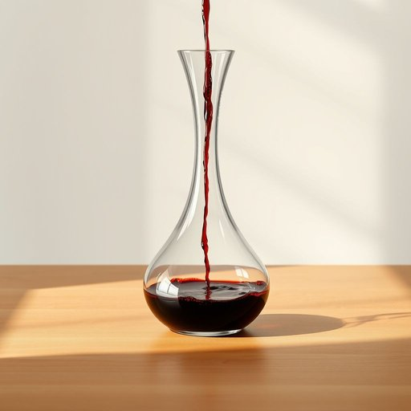

# decanter

<h1 style="font-size: 2.5em; font-weight: 300; letter-spacing: 2px; margin: 0; color: #2c3e50;">
/decanter*/
</h1>

---

---

## 例句

After carefully selecting a vintage bottle of red wine that had been ageing gracefully in the cellar, she poured it slowly into an elegant crystal decanter, whose wide base and narrow neck not only allowed the wine to aerate properly but also added a touch of sophistication to the evening's intimate dinner party.

*After(/ˈæftər/) carefully(/ˈkɛrfəli/) selecting(/səˈlɛktɪŋ/) a(/ə/) vintage(/ˈvɪntɪʤ/) bottle(/ˈbɑtəl/) of(/əv/) red(/rɛd/) wine(/waɪn/) that(/ðət/) had(/hæd/) been(/bɪn/) ageing(/ageing*/) gracefully(/ˈgreɪsfəli/) in(/ɪn/) the(/ðə/) cellar,(/ˈsɛlər,/) she(/ʃi/) poured(/pɔrd/) it(/ɪt/) slowly(/sˈloʊli/) into(/ˈɪntu/) an(/ən/) elegant(/ˈɛləgənt/) crystal(/ˈkrɪstəl/) decanter,(/decanter*,/) whose(/huz/) wide(/waɪd/) base(/beɪs/) and(/ənd/) narrow(/ˈnɛroʊ/) neck(/nɛk/) not(/nɑt/) only(/ˈoʊnli/) allowed(/əˈlaʊd/) the(/ðə/) wine(/waɪn/) to(/tɪ/) aerate(/aerate*/) properly(/ˈprɑpərli/) but(/bət/) also(/ˈɔlsoʊ/) added(/ˈædɪd/) a(/ə/) touch(/təʧ/) of(/əv/) sophistication(/səˌfɪstəˈkeɪʃən/) to(/tɪ/) the(/ðə/) evening's(/ˈivnɪŋz/) intimate(/ˈɪnɪmət/) dinner(/ˈdɪnər/) party.(/ˈpɑrti./)*

**翻译：** 她精心挑选了一瓶在酒窖中优雅陈酿的老年份红酒，缓缓倒入一只典雅的水晶醒酒器中，宽大的底座与狭窄的瓶颈不仅使酒液得以充分醒发，也为这个温馨的晚宴增添了一丝别致的韵味。

---

## 解释

“decanter”作为家居生活用品中的名词，指的是一种用于盛放和倒酒的容器，通常具有宽口和较大的容量，常见于红酒、白兰地等酒类的倒置和醒酒过程中。具体使用场合包括家庭聚会、正式晚宴或酒吧等环境，主要功能是将酒液从瓶中倒出，帮助酒液与空气充分接触以释放香气，同时避免酒渣混入。英语学习者在使用“decanter”时应注意它是可数名词，常见搭配有“wine decanter”（红酒醒酒器）、“glass decanter”（玻璃醒酒器），常见表达如“pour the wine into the decanter”（把酒倒入醒酒器），此类搭配能帮助理解其具体用途。词源上，“decanter”源自拉丁语“decanthare”，意为“倒出”，经由法语“décanter”进入英语，反映了其作为倒酒器具的功能属性。在中文语境中，“decanter”通常被译为“醒酒器”或“酒瓶”，虽然“酒瓶”较泛，但“醒酒器”更准确，强调其醒酒作用。该词无明显褒贬色彩，属于中性名词，但在文化内涵上，使用醒酒器往往与讲究饮酒礼仪和品酒文化相关，体现一定的生活品味和对酒质的重视。

---

<small style="color: #999; font-size: 0.9em;">2025-07-17 06:22:39</small>

