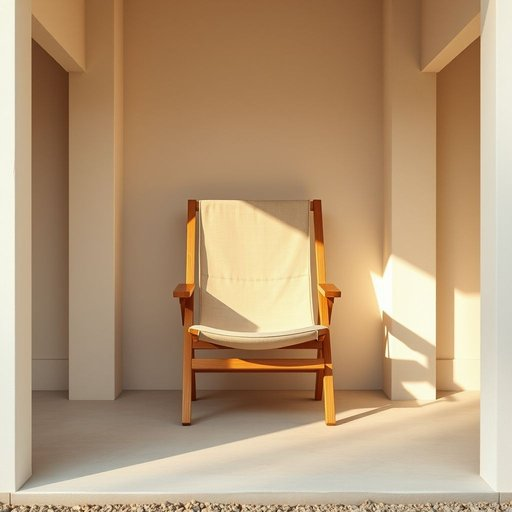

# deckchair

<h1 style="font-size: 2.5em; font-weight: 300; letter-spacing: 2px; margin: 0; color: #2c3e50;">
/deckchair*/
</h1>

---

---

## 例句

After tidying up the cluttered garden shed, I finally found the deckchair, which, despite its worn fabric and creaky wooden frame, still offered a surprisingly comfortable spot to sit and enjoy the late afternoon sun while reading my favourite novel.

*After(/ˈæftər/) tidying(/tidying*/) up(/əp/) the(/ðə/) cluttered(/ˈklətərd/) garden(/ˈgɑrdən/) shed,(/ʃɛd,/) I(/aɪ/) finally(/ˈfaɪnəli/) found(/faʊnd/) the(/ðə/) deckchair,(/deckchair*,/) which,(/wɪʧ,/) despite(/dɪˈspaɪt/) its(/ɪts/) worn(/wɔrn/) fabric(/ˈfæbrɪk/) and(/ənd/) creaky(/ˈkriki/) wooden(/ˈwʊdən/) frame,(/freɪm,/) still(/stɪl/) offered(/ˈɔfərd/) a(/ə/) surprisingly(/səˈpraɪzɪŋli/) comfortable(/ˈkəmfərtəbəl/) spot(/spɑt/) to(/tɪ/) sit(/sɪt/) and(/ənd/) enjoy(/ˌɛnˈʤɔɪ/) the(/ðə/) late(/leɪt/) afternoon(/ˌæftərˈnun/) sun(/sən/) while(/waɪl/) reading(/ˈrɛdɪŋ/) my(/maɪ/) favourite(/ˈfeɪvərɪt/) novel.(/ˈnɑvəl./)*

**翻译：** 整理好杂乱的花园工具棚后，我终于找到了那把躺椅。尽管它的布料已经磨损，木质框架吱吱作响，但依然是一个出乎意料的舒适之地，可以坐下来享受傍晚的阳光，同时阅读我最喜爱的小说。

---

## 解释

英语名词“deckchair”在家居生活用品领域指的是一种折叠式躺椅，通常由木制框架和布制座面组成，常见于阳台、花园、露台或海滩等户外休闲场合，用于人们舒适地坐卧或晒太阳。英语学习者使用“deckchair”时需注意其为可数名词，复数形式为“deckchairs”，常见搭配包括“sit on a deckchair”（坐在躺椅上）、“fold up the deckchair”（折叠躺椅）以及“deckchair cushions”（躺椅垫子）等。该词源于“deck”（甲板）和“chair”（椅子）的组合，最早出现在19世纪，指的是船只甲板上供乘客休息的折叠椅，后来引申为户外使用的便携式躺椅。在中文语境中，“deckchair”准确翻译为“折叠躺椅”或“甲板椅”，强调其便携性和户外休闲用途，常与“沙滩椅”、“折叠椅”区别开来，以突出其专门用于日光浴和休憩的特性。该词本身无明显褒贬色彩，属于中性词汇，但因其与休闲生活紧密相关，多携带轻松舒适的文化内涵，适合描述休闲家具或户外活动装备。

---

<small style="color: #999; font-size: 0.9em;">2025-07-17 06:22:39</small>

