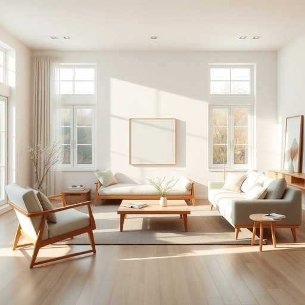

# decor

<h1 style="font-size: 2.5em; font-weight: 300; letter-spacing: 2px; margin: 0; color: #2c3e50;">
/ˈdeɪkɔr/
</h1>

---

---

## 例句

When the decision to change the decor of the living room was made, the chosen Scandinavian-inspired decor not only maximized natural light with minimalist furniture and soft pastel colors but also incorporated sustainable materials, creating an atmosphere that was both modern and environmentally friendly.

*When(/wɪn/) the(/ðə/) decision(/dɪˈsɪʒən/) to(/tɪ/) change(/ʧeɪnʤ/) the(/ðə/) decor(/ˈdeɪkɔr/) of(/əv/) the(/ðə/) living(/ˈlɪvɪŋ/) room(/rum/) was(/wɑz/) made,(/meɪd,/) the(/ðə/) chosen(/ˈʧoʊzən/) Scandinavian-inspired(/scandinavian-inspired*/) decor(/ˈdeɪkɔr/) not(/nɑt/) only(/ˈoʊnli/) maximized(/ˈmæksəˌmaɪzd/) natural(/ˈnæʧərəl/) light(/laɪt/) with(/wɪθ/) minimalist(/ˈmɪnəməlɪst/) furniture(/ˈfərnɪʧər/) and(/ənd/) soft(/sɔft/) pastel(/pæˈstɛl/) colors(/ˈkələrz/) but(/bət/) also(/ˈɔlsoʊ/) incorporated(/ˌɪnˈkɔrpərˌeɪtɪd/) sustainable(/səˈsteɪnəbəl/) materials,(/məˈtɪriəlz,/) creating(/kriˈeɪtɪŋ/) an(/ən/) atmosphere(/ˈætməsˌfɪr/) that(/ðət/) was(/wɑz/) both(/boʊθ/) modern(/ˈmɑdərn/) and(/ənd/) environmentally(/ɪnˌvaɪrənˈmɛnəli/) friendly.(/ˈfrɛndli./)*

**翻译：** 当决定更换客厅装饰风格时，所选的斯堪的纳维亚风格不仅通过简约的家具和柔和的粉彩色调最大限度地利用了自然光，还融入了可持续材料，营造出既现代又环保的氛围。

---

## 解释

英语单词“decor”在家居生活用品领域作为名词，通常指的是室内装饰风格或布置，包括家具、窗帘、色彩、灯饰等整体视觉效果与氛围的设计与安排，使用场合多见于描述房间、家居环境的美学特色，例如“modern decor”（现代装饰风格）或“rustic decor”（乡村装饰风格）。英语学习者在使用“decor”时应注意它是不可数名词，通常不加复数形式，且常与形容词连用来描述具体风格，常用搭配有“home decor”（家居装饰）、“interior decor”（室内装饰）、“decor style”（装饰风格）等，而表达技巧上需避免误用为具体的装饰物品，而是整体风格的概念。同时，“decor”源自法语“décor”，意指布置、布景，最初多用于戏剧舞台背景的布置，后来引申至居室装饰，词根带有“装饰、布置”的含义。在中文语境中，“decor”通常准确翻译为“装饰风格”或“室内装饰”，强调的是空间整体氛围和设计感，而非单一物品，属于中性词汇，不带褒贬感，文化内涵上反映西方对家居美学的整体追求与生活品质重视，使用时应避免简单直译为“装饰”或“装饰品”，以免混淆具体事物与整体风格的区别。

---

<small style="color: #999; font-size: 0.9em;">2025-07-17 06:22:39</small>

