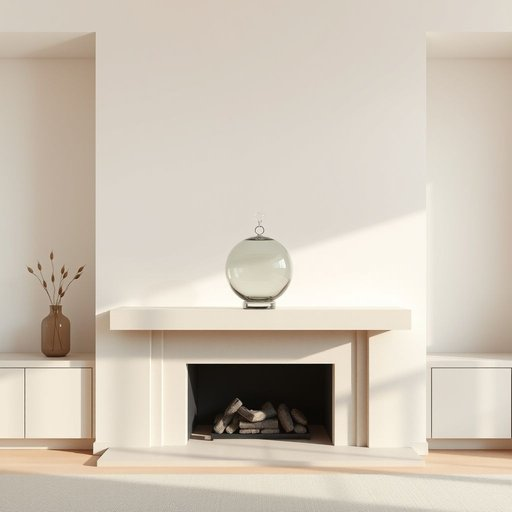

# decoration

<h1 style="font-size: 2.5em; font-weight: 300; letter-spacing: 2px; margin: 0; color: #2c3e50;">
/ˌdɛkərˈeɪʃən/
</h1>

---

---

## 例句

The delicate glass decoration, which we carefully chose last weekend to complement the vintage style of the living room, not only adds a subtle touch of elegance but also serves as a charming focal point on the mantelpiece, catching the light beautifully throughout the day.

*The(/ðə/) delicate(/ˈdɛləkət/) glass(/glæs/) decoration,(/ˌdɛkərˈeɪʃən,/) which(/wɪʧ/) we(/wi/) carefully(/ˈkɛrfəli/) chose(/ʧoʊz/) last(/læst/) weekend(/ˈwiˌkɪnd/) to(/tɪ/) complement(/ˈkɑmpləmənt/) the(/ðə/) vintage(/ˈvɪntɪʤ/) style(/staɪl/) of(/əv/) the(/ðə/) living(/ˈlɪvɪŋ/) room,(/rum,/) not(/nɑt/) only(/ˈoʊnli/) adds(/ædz/) a(/ə/) subtle(/ˈsətəl/) touch(/təʧ/) of(/əv/) elegance(/ˈɛləgəns/) but(/bət/) also(/ˈɔlsoʊ/) serves(/sərvz/) as(/ɛz/) a(/ə/) charming(/ˈʧɑrmɪŋ/) focal(/ˈfoʊkəl/) point(/pɔɪnt/) on(/ɔn/) the(/ðə/) mantelpiece,(/mantelpiece*,/) catching(/ˈkæʧɪŋ/) the(/ðə/) light(/laɪt/) beautifully(/ˈbjutəfli/) throughout(/θruaʊt/) the(/ðə/) day.(/deɪ./)*

**翻译：** 我们上周末精心挑选的精致玻璃装饰，不仅为复古风格的客厅增添了一抹细腻的典雅，还成为壁炉架上迷人的焦点，整日美丽地映照着光线。

---

## 解释

单词“decoration”作为名词，在家居生活用品的语境中通常指用于美化和装饰居室环境的各种装饰物品或装饰行为，比如挂画、盆栽、彩灯、墙纸等，用以提升空间美感和氛围。在具体使用场合上，常见于描述装修设计、室内布置、节日装饰等情形，例如“holiday decorations”指节日装饰品，“home decorations”则泛指家中摆设的美化用品。英语学习者使用“decoration”时需注意其为可数名词时通常指具体的装饰物，如“a decoration”，不可数时则泛指装饰的行为或效果；此外，“decoration”多用作单数，但在表示多种装饰品集合时可用复数“decorations”。常见搭配包括“Christmas decorations”（圣诞装饰）、“wall decoration”（墙面装饰）和“interior decoration”（室内装饰），搭配形容词时常见如“colorful decorations”（色彩丰富的装饰）。该词源自拉丁语“decoratio”，意为“装饰、打扮”，其根源来自拉丁动词“decorare”，即“使美丽”或“修饰”，反映了装饰的本质是为了美化物品或空间。在中文语境中，“decoration”准确翻译为“装饰”或“装饰品”，强调对环境或物体的美化作用，既可指具体物品，也可指装饰的行为或过程。需注意的是，该词一般无褒贬含义，属于中性词，文化内涵上体现了人们对美感和生活品质的追求，使用时应根据语境区分具体指代是物品还是行为，否则可能导致理解混淆。

---

<small style="color: #999; font-size: 0.9em;">2025-07-17 06:22:39</small>

