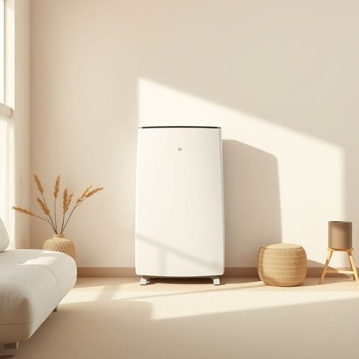

# dehumidifier

<h1 style="font-size: 2.5em; font-weight: 300; letter-spacing: 2px; margin: 0; color: #2c3e50;">
/dihjuˈmɪdəfaɪər/
</h1>

---

---

## 例句

After the prolonged exposure to relentless damp that had permeated the walls and furniture, causing not only a musty odor but also contributing to the deterioration of the building’s structural integrity, the tenant insisted on installing a dehumidifier with advanced features such as humidity sensors, quiet operation, and energy-saving capabilities to mitigate the damage and improve indoor air quality significantly.

*After(/ˈæftər/) the(/ðə/) prolonged(/prəˈlɔŋd/) exposure(/ɪkˈspoʊʒər/) to(/tɪ/) relentless(/rɪˈlɛntlɪs/) damp(/dæmp/) that(/ðət/) had(/hæd/) permeated(/ˈpərmiˌeɪtɪd/) the(/ðə/) walls(/wɔlz/) and(/ənd/) furniture,(/ˈfərnɪʧər,/) causing(/ˈkɔzɪŋ/) not(/nɑt/) only(/ˈoʊnli/) a(/ə/) musty(/ˈməsti/) odor(/ˈoʊdər/) but(/bət/) also(/ˈɔlsoʊ/) contributing(/kənˈtrɪbjutɪŋ/) to(/tɪ/) the(/ðə/) deterioration(/dɪˈtɪriərˌeɪʃən/) of(/əv/) the(/ðə/) building’s(/building’s*/) structural(/ˈstrəkʧərəl/) integrity,(/ˌɪnˈtɛgrəti,/) the(/ðə/) tenant(/ˈtɛnənt/) insisted(/ˌɪnˈsɪstɪd/) on(/ɔn/) installing(/ˌɪnˈstɔlɪŋ/) a(/ə/) dehumidifier(/dihjuˈmɪdəfaɪər/) with(/wɪθ/) advanced(/ədˈvænst/) features(/ˈfiʧərz/) such(/səʧ/) as(/ɛz/) humidity(/hjuˈmɪdəti/) sensors,(/ˈsɛnsərz,/) quiet(/kwaɪət/) operation,(/ˌɑpərˈeɪʃən,/) and(/ənd/) energy-saving(/energy-saving*/) capabilities(/ˌkeɪpəˈbɪlətiz/) to(/tɪ/) mitigate(/ˈmɪtəˌgeɪt/) the(/ðə/) damage(/ˈdæmɪʤ/) and(/ənd/) improve(/ˌɪmˈpruv/) indoor(/ˈɪnˌdɔr/) air(/ɛr/) quality(/kˈwɑləti/) significantly.(/sɪgˈnɪfɪkəntli./)*

**翻译：** 在长时间暴露于浸透墙壁与家具的潮湿环境中，不仅产生了霉味，还加速了建筑结构的损害，租户因此坚持安装一台具备湿度传感器、静音运行及节能功能的先进除湿机，以有效减轻损害并显著改善室内空气质量。

---

## 解释

“dehumidifier”作为名词，指的是一种用于减少室内空气湿度的家用电器，常见于潮湿环境中以防止霉菌滋生和家具受潮。具体使用场合多见于家居生活中，如浴室、地下室、衣柜或整体居室环境，特别在气候潮湿或多雨地区，帮助改善居住舒适度和保护家居物品。英语学习者在使用该词时应注意其为可数名词，常见搭配包括“portable dehumidifier”（便携式除湿机）、“industrial dehumidifier”（工业除湿机）、“operate a dehumidifier”（操作除湿机）等，且通常与动词“run”、“use”或“buy”连用。该词由前缀“de-”（去除，降低）、“humid”（湿气）和后缀“-ifier”（表示工具或装置）构成，意指用来除去湿气的装置。中文语境中，“dehumidifier”准确翻译为“除湿机”或“干燥机”，它不带有褒贬色彩，仅描述一种功能性家用电器，无特殊文化内涵，属于生活用品类别。理解时应区分其与空调、加湿器等设备的不同功能，准确把握其作用焦点为“降低湿度”而非调节温度或增加湿气。

---

<small style="color: #999; font-size: 0.9em;">2025-07-17 06:22:39</small>

