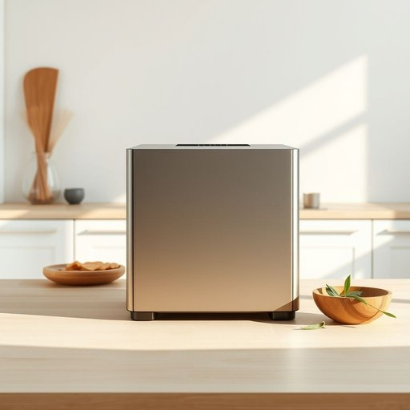

# dehydrator

<h1 style="font-size: 2.5em; font-weight: 300; letter-spacing: 2px; margin: 0; color: #2c3e50;">
/dehydrator*/
</h1>

---

---

## 例句

After the discovery of the artifact, the museum organized an exhibition to showcase its historical significance and attract scholars interested in ancient civilizations.

*After(/ˈæftər/) the(/ðə/) discovery(/ˌdɪˈskəvri/) of(/əv/) the(/ðə/) artifact,(/ˈɑrtəˌfækt,/) the(/ðə/) museum(/mˈjuziəm/) organized(/ˈɔrgəˌnaɪzd/) an(/ən/) exhibition(/ˌɛksəˈbɪʃən/) to(/tɪ/) showcase(/ˈʃoʊˌkeɪs/) its(/ɪts/) historical(/hɪˈstɔrɪkəl/) significance(/sɪgˈnɪfɪkəns/) and(/ənd/) attract(/əˈtrækt/) scholars(/ˈskɑlərz/) interested(/ˈɪntəˌrɛstɪd/) in(/ɪn/) ancient(/ˈeɪnʧənt/) civilizations.(/ˌsɪvəlɪˈzeɪʃənz./)*

**翻译：** 在发现该文物后，博物馆举办了一场展览，旨在展示其历史意义，并吸引对古代文明感兴趣的学者前来参观。

---

## 解释

英语单词“dehydrator”作为名词，通常指一种用于去除物品中特别是食品中水分的家用电器或设备，常见于家居生活用品场景中，主要用于制作干果、果脯、蔬菜干等健康零食，或者用于食物保存以延长保质期。在具体使用时，常出现在厨房环境描述或健康饮食讨论中，如“The dehydrator helps preserve fruits by removing moisture.”对于英语学习者来说，“dehydrator”是可数名词，常用复数形式“dehydrators”，且常与动词“use,” “buy,” “operate”搭配，描述操作动作时要注意介词搭配，如“use a dehydrator for drying fruits.”此外，形容词“electric”或“food”经常与之搭配以限定所指类型。词源上，“dehydrator”由前缀“de-”（去除）与词根“hydrate”（水合，含水）加上名词后缀“-or”组成，字面意思即“去除水分的装置”，反映出其功能属性。在中文语境中，“dehydrator”精确译为“脱水机”或“食物脱水机”，强调其专业设备性质，无明显褒贬色彩，但在日常生活中较为专业，通常在健康饮食或食品加工领域出现，使用时体现绿色养生和自制食品的文化倾向，总的来说该词语含义中性，功能明确，常见于现代厨房设备介绍和健康食品制作讨论中。

---

<small style="color: #999; font-size: 0.9em;">2025-07-17 06:22:39</small>

