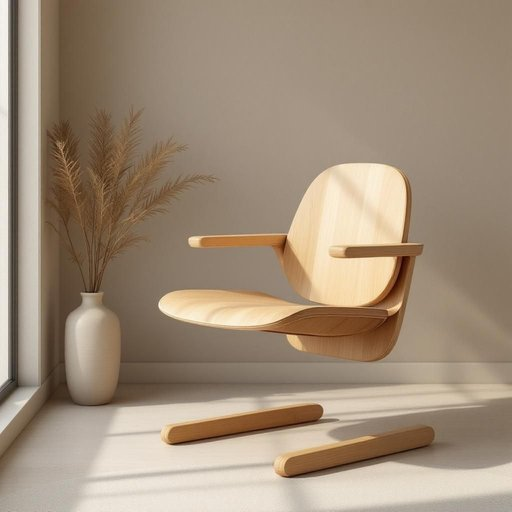

# desk-chair

<h1 style="font-size: 2.5em; font-weight: 300; letter-spacing: 2px; margin: 0; color: #2c3e50;">
/desk-chair*/
</h1>

---

---

## 例句

After the meeting, the feedback from the manager, which included detailed notes on each project, became an invaluable resource for the entire team’s improvement and future planning.

*After(/ˈæftər/) the(/ðə/) meeting,(/ˈmitɪŋ,/) the(/ðə/) feedback(/ˈfidˌbæk/) from(/frəm/) the(/ðə/) manager,(/ˈmænɪʤər,/) which(/wɪʧ/) included(/ˌɪnˈkludɪd/) detailed(/dɪˈteɪld/) notes(/noʊts/) on(/ɔn/) each(/iʧ/) project,(/ˈprɑʤɛkt,/) became(/bɪˈkeɪm/) an(/ən/) invaluable(/ˌɪnˈvæljəbəl/) resource(/ˈrisɔrs/) for(/fər/) the(/ðə/) entire(/ɪnˈtaɪər/) team’s(/team’s*/) improvement(/ˌɪmˈpruvmənt/) and(/ənd/) future(/fˈjuʧər/) planning.(/ˈplænɪŋ./)*

**翻译：** 会议结束后，经理的反馈中包含了对每个项目的详细记录，成为整个团队改进与未来规划的宝贵资源。

---

## 解释

desk-chair作为名词在家居生活用品的英语语境中，通常指的是那种设计用于办公桌旁使用的椅子，兼具桌椅功能的椅子或特别适合搭配写字台使用的椅子，常见于家庭书房、办公室或学习角落。具体使用场合多见于描述工作、学习环境，如请坐到你的desk-chair上开始写作业或这把desk-chair的舒适度很高，适合长时间使用。英语学习者在使用desk-chair时需注意它是一个复合名词，通常作为单数形式出现，且前部desk作定语修饰后部chair，在表达时常与形容词连用，如comfortable desk-chair或作为动词宾语，如buy a desk-chair；此外，复合名词的书写形式有时会存在变体，如desk chair没有连字符，语境会因习惯而异，但需保持一致。词源方面，desk-chair由desk（书桌、办公桌）和chair（椅子）组合而成，反映了功能性命名的词汇构造，强调椅子与桌子的配套和使用场景。中文中，desk-chair准确的翻译一般为书桌椅或办公椅，强调其与桌子的搭配关系，而非普通椅子，侧重实用性和工作学习功能。在文化语境中，desk-chair无明显褒贬含义，属于中性词汇，但当描述质量或设计时，往往隐含舒适性、人体工学或专业性等积极评价，使用时需结合具体形容词或句子语境以传达准确信息。

---

<small style="color: #999; font-size: 0.9em;">2025-07-17 06:22:39</small>

