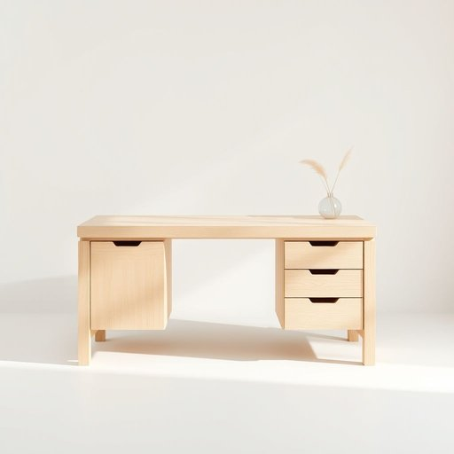

# desk

<h1 style="font-size: 2.5em; font-weight: 300; letter-spacing: 2px; margin: 0; color: #2c3e50;">
/dɛsk/
</h1>

---

---

## 例句

The knowledge cut-off date, which is set as June 2024 to ensure the accuracy and relevance of the information provided, significantly impacts the scope of data that can be included in responses, limiting both the historical context and the incorporation of the very latest developments in various fields.

*The(/ðə/) knowledge(/ˈnɑlɪʤ/) cut-off(/cut-off*/) date,(/deɪt,/) which(/wɪʧ/) is(/ɪz/) set(/sɛt/) as(/ɛz/) June(/ʤun/) 2024(/2024/) to(/tɪ/) ensure(/ɪnˈʃʊr/) the(/ðə/) accuracy(/ˈækjərəsi/) and(/ənd/) relevance(/ˈrɛləvəns/) of(/əv/) the(/ðə/) information(/ˌɪnˌfɔrˈmeɪʃən/) provided,(/prəˈvaɪdɪd,/) significantly(/sɪgˈnɪfɪkəntli/) impacts(/ˌɪmˈpækts/) the(/ðə/) scope(/skoʊp/) of(/əv/) data(/ˈdætə/) that(/ðət/) can(/kən/) be(/bi/) included(/ˌɪnˈkludɪd/) in(/ɪn/) responses,(/rɪˈspɑnsɪz,/) limiting(/ˈlɪmətɪŋ/) both(/boʊθ/) the(/ðə/) historical(/hɪˈstɔrɪkəl/) context(/ˈkɑntɛkst/) and(/ənd/) the(/ðə/) incorporation(/ˌɪnˌkɔrpərˈeɪʃən/) of(/əv/) the(/ðə/) very(/ˈvɛri/) latest(/ˈleɪtəst/) developments(/dɪˈvɛləpmənts/) in(/ɪn/) various(/ˈvɛriəs/) fields.(/fildz./)*

**翻译：** 知识截止日期定为2024年6月，此举旨在确保所提供信息的准确性和相关性，该日期显著影响了可纳入回答的数据范围，限制了历史背景的涵盖以及各领域最新进展的融入。

---

## 解释

英语单词“desk”作为名词在家居生活用品语境中通常指一种专门用于书写、学习、办公的带有平面桌面和储物空间（如抽屉或格子）的家具，常见于卧室书房、办公室或教室。使用场合多为需要放置书籍、电脑、文具或文件的环境，强调其功能性和组织性。英语学习者在使用“desk”时需注意其单数复数形式“desk/desks”，以及常与动词“sit at”（坐在桌前）、“work at”（在桌前工作）、“clean/organize the desk”（清理/整理桌面）等搭配，表达时也可与形容词连用，如“wooden desk”（木制书桌）、“study desk”（学习桌）、“office desk”（办公桌）。此外，“desk”在句中多用作可数名词。其词源来自中古英语“deske”，源于意大利语“desco”意为桌子，反映了欧洲早期家具风格和功能的延续。在中文语境中，“desk”最准确的翻译为“桌子”或“书桌”，具体语境需结合实际功能确定，比如“书桌”强调学习用途，“办公桌”强调工作用途，没有特别的褒贬色彩，属于中性词汇，文化内涵主要关联现代生活中学习和办公的场所，是家庭和职场中常见且必要的家具类型。

---

<small style="color: #999; font-size: 0.9em;">2025-07-17 06:22:39</small>

